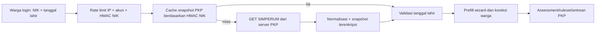

# Kontrak Integrasi SIMPERUM API

**Diverifikasi:** 28 Juli 2026  
**Sumber:** `SIMPERUM API.pdf` (9 halaman, dibuat 14 Agustus 2020)  
**Status:** adapter GET selesai lokal dan teruji offline; mode tetap
`simulation` sampai smoke test berizin dan sumber desil tersedia.

Dokumen ini tidak memuat public/private key. Kredensial hanya boleh berada di
environment server.

## 1. Kontrak yang Diterima

Base URL:

```text
https://simperum.disperakim.jatengprov.go.id/api/pub/
```

Endpoint yang dipakai Klinik PKP:

```text
GET GetDataRTLH?NIK=<16 digit NIK>
Authorization: md5(<perintah_url> + <private_key>) + "." + <public_key>
```

`perintah_url` mencakup nama endpoint dan query dengan penulisan persis,
contoh `GetDataRTLH?NIK=...`. Body GET kosong.

Dokumen juga menyediakan `POST SaveDataRTLH`, tetapi endpoint itu **tidak
diimplementasikan**. Keputusan produk saat ini adalah membaca sumber SIMPERUM,
menyimpan snapshot dan koreksi warga di server PKP, bukan menulis balik ke
SIMPERUM.

## 2. Jalur Data



Browser tidak pernah menerima key dan tidak memanggil SIMPERUM langsung.
Endpoint diagnosa lama tidak boleh memakai API nyata; saat mode `api`, lookup
nyata hanya tersedia melalui wizard warga yang mewajibkan login.

## 3. Pemetaan Response ke Skema Canonical

| SIMPERUM | Canonical PKP | Catatan |
|---|---|---|
| `IDBDT` | `source_record_key` | `null` bila kosong; NIK tidak dipakai sebagai kunci plaintext |
| `NIK` | `identity.nik` | wajib sama dengan NIK permintaan |
| `Nama` | `identity.full_name` | wajib untuk membuat profil |
| `Alamat` | `identity.address` | boleh dikoreksi warga |
| `JenisKelamin` | `gender_code` | `L/P` -> `male/female` |
| `TahunLahir` | `identity.birth_year` | bukan tanggal lahir penuh |
| `Pendidikan` | `education_code` | kode `0-6` sesuai PDF |
| `Pekerjaan` | `occupation_code` | kode `1-22`, `98`, `99` |
| `Penghasilan` | `income_band_code` | kode `7` disimpan `gt_4_2`, tidak dipersempit |
| `MampuSwadaya` | `self_help_capability_code` | `0/1` |
| `KepemilikanRumah` | `housing_status_code` | kode `1-5` |
| `KepemilikanLahan` | `land_title_code` | kode `1` menjadi `certificate_unspecified` |
| `TanahLain` / `RumahLain` | `has_other_land` / `has_other_house` | hanya `0/1` |
| `LuasRumah` | `house_area_m2` | numerik |
| `JmlPenghuni` / `JmlKK` | `occupant_count` / `family_count` | integer |
| `SumberDanaID` | `assistance_source_code` | kode resmi PDF |
| `TahunIntervensi` | `assistance_year` | juga untuk memilih record terbaru |
| `KawasanPerumahan` | `area_condition_code` | kode `1,6,10,11,12,98,99` |
| `AtapID` / `LantaiID` / `DindingID` | material atap/lantai/dinding | katalog PDF lengkap |
| `KondisiKolom` / `KondisiBalok` / `KondisiRangka` | kondisi struktur | kode kondisi `1-4` |
| `AdaPondasi=0` | pondasi `severe_damage_or_absent` | `1` tidak dianggap otomatis baik |
| `KondisiAtap/Lantai/Dinding` | kondisi material | dipakai bila respons mengirim; contoh GET tidak memuatnya |
| `AdaJendela` / `AdaVentilasi` | boolean canonical | `0/1` |
| `SumberAir` | `water_source_code` | `Ledeng` tidak ditebak menjadi PDAM |
| `Penerangan` | `lighting_source_code` | kode `1-4` |
| `JarakSepticTank` | `septic_distance_code` | `0=<10m`, `1=>=10m` |
| `KodeDagri` | `location.kabupaten_id` | empat digit pertama, lalu diverifikasi ke master PKP |
| `GeoLat` / `GeoLng` | koordinat assessment | disimpan terenkripsi |

Nilai tak dikenal menjadi `null` dan dicatat pada `source.unmapped_codes`;
tidak pernah ditebak. Raw record tetap berada dalam snapshot terenkripsi.

## 4. Field yang Tidak Disediakan

Dokumen API ini tidak menyediakan:

- desil kesejahteraan/DTSEN;
- tanggal lahir penuh (hanya `TahunLahir`, sering dapat `null`);
- nomor KK, telepon, status perkawinan, NPWP, tabungan;
- kode resmi `LetakSanitasi` dan `KamarMandi`;
- data khusus pembiayaan/KPR.

Konsekuensi terpenting: ruleset `SIM-2026-01` memakai desil sebagai routing
utama. Tanpa endpoint/field desil, mode API dapat melakukan prefill RTLH tetapi
tidak boleh mengarang rekomendasi program. Hasil akan `needs_data`.

Tanggal lahir yang dimasukkan warga divalidasi terhadap struktur tanggal pada
NIK dan `TahunLahir` bila tersedia. Karena API hanya menerima NIK, tanggal lahir
bukan faktor autentikasi dari SIMPERUM dan tidak boleh diklaim demikian.

## 5. Ketahanan dan Keamanan

- TLS peer/hostname verification wajib aktif; tidak ada fallback HTTP.
- Connect timeout default 5 detik, total timeout 12 detik.
- GET transient/5xx dicoba ulang satu kali setelah 200 ms.
- `401/403`, `429`, non-2xx, timeout, JSON rusak, dan NIK respons berbeda
  menjadi error berkode dan tidak membocorkan payload/kunci ke browser.
- Snapshot `found` berlaku 30 hari, `not_found` 1 hari, `error` 15 menit.
- Cache dan lock mencegah panggilan besar-besaran untuk NIK yang sama.
- Snapshot baru untuk NIK yang sama melahirkan versi assessment baru agar
  provenance dan raw source tidak tercampur dengan snapshot lama.
- Public/private key tidak boleh masuk log, snapshot, fixture, dokumen, atau Git.

## 6. Konfigurasi

```dotenv
SIMPERUM_MODE=simulation
SIMPERUM_BASE_URL=https://simperum.disperakim.jatengprov.go.id/api/pub/
SIMPERUM_PUBLIC_KEY=
SIMPERUM_PRIVATE_KEY=
SIMPERUM_CONNECT_TIMEOUT=5
SIMPERUM_TIMEOUT=12
```

Nilai lokal sudah ditempatkan pada `.env` yang diabaikan Git. Mode tidak
diubah ke `api` agar demo lengkap berbasis desil tetap berjalan.

## 7. Bukti dan Batas Aktivasi

Check offline:

```text
php docs/engineering/uji_simperum_api_contract.php
27 pemeriksaan, 0 gagal
```

Runner fresh seluruh fitur warga tetap hijau **224/224** pada mode simulation.

Belum dilakukan:

1. request live dengan NIK warga;
2. pengujian quota/format error nyata;
3. UAT mode `api`;
4. aktivasi production.

Smoke test live wajib memakai NIK uji resmi atau warga yang menyetujui, serta
izin eksplisit untuk mengirim NIK itu ke SIMPERUM. Sebelum aktivasi, minta Tim
SIMPERUM menjawab:

1. endpoint/field desil yang menjadi dasar rekomendasi;
2. quota per key/IP dan aturan cooldown;
3. bentuk respons NIK tidak ditemukan, key salah, dan rate limit;
4. apakah dokumentasi 2020 masih kontrak aktif;
5. kebijakan retensi dan izin menyimpan snapshot di PKP.
