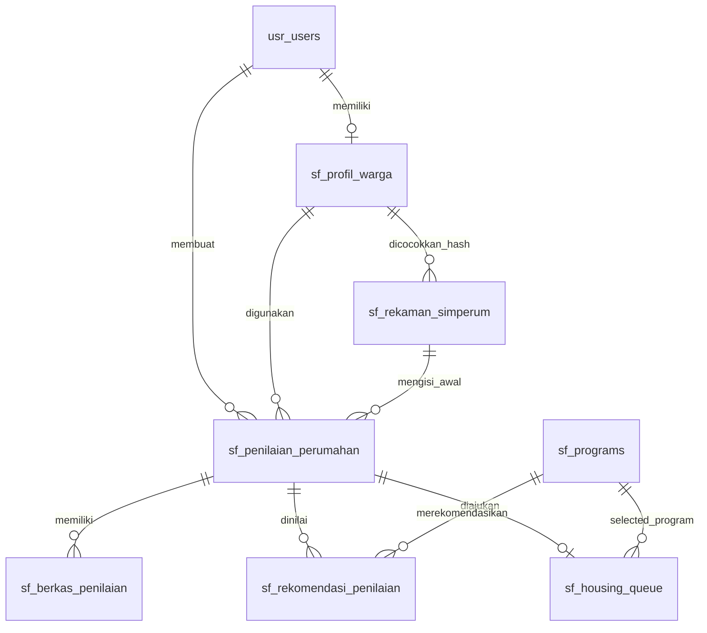

# Skema Data Form Warga dan Cache SIMPERUM

**Versi:** 1.0-draft  
**Tanggal:** 27 Juli 2026  
**Status:** Rancangan; belum menjadi migrasi  
**PRD:** [`PRD_FORM_WARGA_SIMPERUM.md`](../product/PRD_FORM_WARGA_SIMPERUM.md)
**Roadmap:** [`ROADMAP_FORM_WARGA_SIMULASI_SIMPERUM.md`](../product/ROADMAP_FORM_WARGA_SIMULASI_SIMPERUM.md)

Dokumen ini mentranskripsikan field dan opsi dari 50 gambar sumber serta
mendefinisikan bentuk data yang tahan terhadap cache, koreksi warga, revisi,
dan perubahan ruleset. Nilai PII contoh pada gambar tidak disalin.

---

## 1. Temuan Struktur

Artefak bukan satu form linear. Ada dua jalur yang terbukti:

1. **RTLH/rumah eksisting:** data warga → rumah/keluarga → struktur →
   sanitasi → lokasi/foto rumah.
2. **Backlog/calon lahan:** data warga → status/asal/legalitas/ukuran tanah →
   lokasi → foto calon lahan dan bukti legal.

Jalur pembiayaan/KPR belum memiliki artefak rinci. Jangan memaksa seluruh
field RTLH ke semua warga.

## 2. Konvensi

- Nama kolom memakai bahasa Inggris singkat agar konsisten dengan tabel `sf_*`;
  label UI tetap Bahasa Indonesia.
- Dropdown menyimpan `option_code`, bukan label.
- Katalog awal hidup di satu config versioned
  (`application/config/housing_assessment.php` saat implementasi), bukan
  disalin ke controller/view dan belum perlu tabel master generik. Naikkan
  versi saat kode/arti opsi berubah.
- Opsi di bawah berasal dari gambar; tanda `⚠` berarti gambar tidak lengkap
  atau konsepnya perlu keputusan bisnis.
- `required` berarti wajib pada cabang yang relevan.
- PII bertanda `ENC` wajib terenkripsi.
- `source` per field: `simperum`, `citizen`, `admin`, atau `derived`.

## 3. Kamus Field

### 3.1 Temukan Data dan Identitas

| Kode | Label | Tipe | Wajib | Sumber awal | Catatan |
|---|---|---|---|---|---|
| `proposal_source_code` | Usulan Dari | option | Belum | SIMPERUM | ⚠ opsi tidak tertangkap |
| `nik` | NIK | digit(16), ENC + hash | Ya | SIMPERUM/input lookup | Tidak pernah di URL/log |
| `family_card_number` | No. KK | digit(16), ENC + hash opsional | Ya | SIMPERUM/warga | Verifikasi kepemilikan belum diputuskan |
| `full_name` | Nama | text, ENC | Ya | SIMPERUM/warga | Simpan nilai raw dan override terpisah |
| `address` | Alamat | text, ENC | Ya | SIMPERUM/warga | Perlu mapping kabupaten/kota |
| `phone` | No. HP | tel, ENC | Kondisional | SIMPERUM/warga | Wajib bila notifikasi dipakai |
| `birth_date` | Tanggal Lahir | date, ENC | Ya | SIMPERUM/warga | Gambar Backlog menampilkan Umur; simpan tanggal, umur diturunkan |
| `gender_code` | Jenis Kelamin | option | Ya | SIMPERUM/warga | ⚠ hanya Laki-Laki terlihat |
| `marital_status_code` | Status Perkawinan | option | Ya | SIMPERUM/warga | Lihat katalog |
| `education_code` | Pendidikan | option | Ya | SIMPERUM/warga | Lihat katalog |
| `occupation_code` | Pekerjaan | option | Ya | SIMPERUM/warga | ⚠ daftar tengah tidak seluruhnya tertangkap |
| `tax_number` | No. NPWP | text, ENC | Tidak | SIMPERUM/warga | Validasi format jika diisi |
| `income_band_code` | Penghasilan | option | Ya untuk scoring | SIMPERUM/warga | Band, bukan angka karangan |
| `welfare_decile` | Desil | tinyint 1–10 | Tidak jika sumber tak ada | SIMPERUM | Read-only; null ≠ 0 |
| `has_savings` | Memiliki Tabungan | boolean | Tidak | SIMPERUM/warga | Jangan infer dari penghasilan |
| `self_help_capability_code` | Mampu Swadaya | option | Ya | SIMPERUM/warga | Mampu/Tidak Mampu |
| `self_help_amount` | Nilai Swadaya | decimal | Kondisional | SIMPERUM/warga | Terlihat pada varian Backlog |

### 3.2 Rumah, Lahan, dan Rumah Tangga

| Kode | Label | Tipe | Wajib | Cabang/aturan |
|---|---|---|---|---|
| `housing_status_code` | Status Rumah | option | Ya | Menentukan cabang |
| `land_title_code` | Status Lahan | option | Rumah eksisting milik sendiri | Legalitas lahan rumah |
| `has_other_land` | Tanah Lain | boolean | Tidak | Memiliki/Tidak Memiliki |
| `has_other_house` | Rumah Lain | boolean | Tidak | Memiliki/Tidak Memiliki |
| `house_area_m2` | Luas Rumah | decimal | Rumah eksisting | > 0 |
| `occupant_count` | Jumlah Penghuni | integer | Ya | ≥ 1 |
| `family_count` | Jumlah Keluarga | integer | Ya | ≥ 1 dan masuk akal terhadap penghuni |
| `assistance_source_code` | Sumber Bantuan | option | Tidak | ⚠ katalog sumber tercampur alasan penutupan |
| `assistance_year` | Tahun | year | Jika sumber bantuan dipilih | Tidak boleh masa depan |
| `area_condition_code` | Kawasan | option | Ya | Katalog berbeda per cabang |
| `owns_candidate_land` | Memiliki Tanah | boolean | Backlog | Menentukan field legalitas |
| `candidate_land_address` | Alamat Tanah | text, ENC | Jika memiliki/calon lahan | |
| `candidate_land_title_code` | Sertifikat Tanah | option | Jika memiliki/calon lahan | Tidak valid jika tanah benar-benar tidak ada |
| `candidate_land_origin_code` | Asal Tanah | option | Jika memiliki/calon lahan | |
| `land_owner_relationship_code` | Hubungan dengan Pemilik | option | Jika bukan milik sendiri | |
| `land_length_m` | Ukuran Tanah — Panjang | decimal | Jika calon lahan | > 0 |
| `land_width_m` | Ukuran Tanah — Lebar | decimal | Jika calon lahan | > 0 |
| `land_area_m2` | Luas Tanah | decimal derived | Derived | panjang × lebar |

### 3.3 Struktur Bangunan

Semua field bagian ini hanya aktif jika ada rumah eksisting yang dinilai.

| Kode | Label | Tipe | Wajib |
|---|---|---|---|
| `foundation_condition_code` | Pondasi | condition option | Ya |
| `column_condition_code` | Kondisi Kolom | condition option | Ya |
| `beam_condition_code` | Kondisi Balok | condition option | Ya |
| `sloof_condition_code` | Kondisi Sloof | condition option | Belum dipastikan |
| `ceiling_condition_code` | Kondisi Plafon | condition option | Belum dipastikan |
| `roof_frame_condition_code` | Rangka Atap | condition option | Ya |
| `floor_material_code` | Bahan Lantai | option | Ya |
| `floor_condition_code` | Kondisi Lantai | condition option | Ya |
| `wall_material_code` | Bahan Dinding | option | Ya |
| `wall_condition_code` | Kondisi Dinding | condition option | Ya |
| `roof_material_code` | Bahan Atap | option | Ya |
| `roof_condition_code` | Kondisi Atap | condition option | Ya |

Catatan: label `Pondasi` dan `Rangka Atap` menampilkan skala kondisi, bukan
material. Nama kanonik sengaja memakai `*_condition_code`.

### 3.4 Sanitasi dan Utilitas

| Kode | Label | Tipe | Wajib | Catatan |
|---|---|---|---|---|
| `has_window` | Jendela | boolean | Belum dipastikan | Ada/Tidak Ada |
| `has_ventilation` | Ventilasi | boolean | Belum dipastikan | Ada/Tidak Ada |
| `water_source_code` | Sumber Air | option | Ya | |
| `has_bathroom_latrine` | Kamar Mandi/Jamban | option/boolean | Ya | ⚠ opsi detail tidak ada |
| `latrine_type_code` | Jenis Jamban | option | Jika memiliki jamban | |
| `feces_disposal_code` | Jenis TPA | option | Jika memiliki jamban | TPA = pembuangan akhir tinja dalam konteks gambar |
| `septic_distance_code` | Jarak Septik Tank | option | Jika septic tank | `<10m`/`>=10m` |
| `lighting_source_code` | Sumber Penerangan | option | Ya | |
| `cooking_fuel_code` | BB Masak | option | Ya | |

### 3.5 Lokasi dan Bukti

| Kode | Label | Tipe | Cabang |
|---|---|---|---|
| `location_lat` | Latitude | decimal, ENC | Semua |
| `location_lng` | Longitude | decimal, ENC | Semua |
| `location_accuracy_m` | Akurasi Lokasi | decimal | Jika GPS tersedia |
| `self_photo` | Foto Diri | private image | Rumah eksisting |
| `house_front_photo` | Rumah Depan | private image | Rumah eksisting |
| `house_side_photo` | Rumah Samping | private image | Rumah eksisting |
| `land_photo` | Foto Lahan | private image | Sesuai cabang |
| `roof_photo` | Foto Atap | private image | Rumah eksisting |
| `floor_photo` | Foto Lantai | private image | Rumah eksisting |
| `wall_photo` | Foto Dinding | private image | Rumah eksisting |
| `latrine_photo` | Foto Jamban | private image | Rumah eksisting |
| `candidate_land_photo` | Foto Calon Lahan | private image | Backlog |
| `land_transfer_proof` | Bukti Pindah Tangan | private image/PDF | Backlog, jika relevan |
| `recipient_photo` | Foto Penerima | private image | Backlog |
| `verification_report` | Berkas Verval | private PDF | Backlog/admin |
| `id_card_photo` | Foto KTP | private image | Backlog |
| `family_card_photo` | Foto KK | private image | Backlog |
| `land_owner_family_card_photo` | Foto KK Pemilik | private image | Jika pemilik pihak lain |

Wajib/tidaknya setiap bukti menunggu OPEN-WRG-008. Persentase `0%` pada
gambar diperlakukan sebagai indikator UI sumber, bukan data bisnis.

## 4. Katalog Opsi yang Terbaca

### 4.1 Demografi

| Field | Opsi |
|---|---|
| Status Perkawinan | `single` Lajang; `married` Menikah; `divorced` Cerai |
| Pendidikan | `no_certificate` Tidak Punya Ijazah; `elementary` SD/sederajat; `junior_high` SMP/sederajat; `senior_high` SMA/sederajat; `diploma_1_3` D1/D2/D3; `bachelor` D4/S1; `postgraduate` S2/S3 |
| Mampu Swadaya | `capable` Mampu; `not_capable` Tidak Mampu |
| Penghasilan | `<1.8 jt`; `1.9–2.1 jt`; `2.2–2.6 jt`; `2.7–3.1 jt`; `3.2–3.6 jt`; `3.7–4.2 jt`; `4.2–6 jt`; `6–8 jt`; `>8 jt` — ⚠ batas pada gambar menyisakan celah, harus dikonfirmasi |

Pekerjaan yang terbaca: Petani, Peternak, Pertambangan/Penggalian, Buruh
Harian, Tukang Bangunan, Pedagang, Hotel & Rumah Makan, Sopir,
Dokter/Bidan/Apoteker, PNS/BUMN/D, Pemulung, Lainnya, TNI/POLRI, Pegawai
Swasta, PHL/PTT, Pensiunan, Tidak Bekerja. Ada bagian daftar yang tidak
terekam; katalog ini belum boleh dianggap lengkap.

### 4.2 Rumah dan Lahan

| Field | Opsi |
|---|---|
| Status Rumah | Milik Sendiri; Kontrak/Sewa; Bebas Sewa; Dinas; Menumpang; Lainnya |
| Status/Sertifikat Lahan | Sertifikat HM; Sertifikat HGB; Letter C; Letter D; Suket Desa; Akta Notaris; Lainnya |
| Tanah/Rumah Lain | Memiliki; Tidak Memiliki |
| Asal Tanah | Milik Sendiri; Warisan; Hibah; Jual Beli |
| Hubungan dengan Pemilik | Orang Tua; Orang Lain |

Opsi `Sumber Bantuan` yang terlihat: APBN, APBD Kab, CSR, Sumber Lainnya,
Sudah Layak Huni, Dana Desa, BSPS KL, Meninggal, Salah/Double Data, BANKAB,
BAZNAS, Pindah. Daftar ini **tidak dinormalisasi** karena mencampur sumber,
keadaan, dan alasan penutupan.

Opsi `Kawasan` yang terlihat pada RTLH: Kekeringan, Kumuh, Rawan Bencana.
Varian Backlog menambah Bantaran Sungai, Bantaran Rel KA, Kawasan Buruk Lain,
dan Kawasan Baik.

### 4.3 Kondisi dan Material

Skala kondisi bersama:

1. `good` — Baik
2. `minor_damage` — Rusak Ringan (Permukaan)
3. `moderate_damage` — Rusak Sedang (Material)
4. `severe_damage_or_absent` — Rusak Berat (Struktur/Tidak Ada)

| Field | Opsi yang terbaca |
|---|---|
| Bahan Lantai | Marmer/Granit; Keramik; Parket/Vinil/Permadani; Ubin/Tegel/Teraso; Kayu/Papan Kualitas Tinggi; Semen/Plesteran; Bambu; Kayu/Papan Kualitas Rendah; Tanah; Lainnya |
| Bahan Dinding | Tembok; Plesteran/GRC; Kayu; Anyaman Bambu; Batang Kayu; Bambu; Lainnya |
| Bahan Atap | Genteng/Tanah Liat; Asbes; Seng; ⚠ daftar mungkin berlanjut |

### 4.4 Sanitasi dan Utilitas

| Field | Opsi |
|---|---|
| Jendela | Ada Jendela; Tidak Ada |
| Ventilasi | Ada Ventilasi; Tidak Ada |
| Jenis Jamban | Leher Angsa; Plengsengan; Cemplung/Cubluk; Tidak Punya |
| Jenis TPA | Tangki Septik; IPAL; Kolam/Sawah/Sungai; Lubang Tanah; Pantai/Tanah Lapang/Kebun |
| Sumber Air | Air Kemasan Bermerek; Air Isi Ulang; PDAM; Leding Eceran; Sumur; Mata Air; Air Hujan; Lainnya/Tidak Layak |
| Jarak Septik Tank | `<10 m`; `>=10 m` |
| Sumber Penerangan | PLN; PLN Non Meteran; Non PLN; Bukan Listrik |
| BB Masak | Listrik/Gas; Minyak Tanah; Arang/Kayu; Lainnya |

## 5. Dependensi Field

| Kondisi | Field aktif | Field tidak ikut validasi/scoring |
|---|---|---|
| Status rumah = Milik Sendiri | status lahan, kondisi bangunan, sanitasi, foto rumah | calon lahan kecuali warga menyatakan tanah lain |
| Status rumah ≠ Milik Sendiri dan tidak punya calon lahan | ekonomi/keluarga untuk pembiayaan | kondisi struktur rumah yang bukan objek bantuan |
| Memiliki calon lahan | alamat, sertifikat, asal, ukuran, lokasi, bukti lahan | kondisi struktur jika belum ada bangunan |
| Tanah milik pihak lain | hubungan pemilik + bukti pemilik | klaim milik sendiri |
| Tidak memiliki jamban | jenis jamban/tangki septik disesuaikan | jarak septik wajib hanya jika ada septic tank |
| Sumber bantuan kosong | tahun bantuan kosong | tahun tidak boleh berdiri sendiri |
| Cabang berubah | nilai lama dipertahankan sebagai inactive | nilai inactive tidak dihitung |

## 6. Skema Tabel Usulan

Ini skema konseptual, bukan SQL migrasi final.

### 6.1 `sf_profil_warga`

Satu profil warga reusable per akun/NIK:

- `id` PK
- `user_id` FK signed → `usr_users.id`, unique
- `nik_ciphertext`, `nik_lookup_hash` unique
- `family_card_ciphertext`, `family_card_lookup_hash`
- `full_name_ciphertext`, `address_ciphertext`, `phone_ciphertext`
- `birth_date_ciphertext`, `tax_number_ciphertext`
- `gender_code`, `marital_status_code`, `education_code`, `occupation_code`
- `income_band_code`, `welfare_decile`, `has_savings`
- `self_help_capability_code`, `self_help_amount`
- `field_provenance_json`
- `confirmed_at`, `created_at`, `updated_at`

### 6.2 `sf_rekaman_simperum`

Riwayat fetch dan cache immutable:

- `id` PK
- `nik_lookup_hash` index
- `source_mode`: `simulation` atau `api`
- `source_record_key`: fixture ID/request fingerprint tanpa PII
- `response_status`: `found`, `not_found`, `error`
- `api_version`, `http_status`, `error_code`
- `payload_ciphertext`, `payload_sha256`
- `fetched_at`, `expires_at`
- `requested_by` FK signed nullable

Tidak ada unique per NIK karena histori fetch harus dapat diaudit. Query cache
memakai snapshot terbaru yang belum kedaluwarsa.

### 6.3 `sf_penilaian_perumahan`

Satu baris per draft/revisi, dengan kolom wide yang mengikuti §3.2–§3.4:

- identitas: `id`, `user_id`, `citizen_profile_id`, `previous_version_id`
- routing: `kabupaten_id`, `assessment_track`
- lifecycle: `status`, `current_step`, `version_no`, `lock_version`
- source: `simperum_snapshot_id`, `profile_snapshot_ciphertext`,
  `field_provenance_json`, `source_mode`
- seluruh field rumah/lahan/struktur/sanitasi bertipe pada §3
- lokasi: `location_lat_ciphertext`, `location_lng_ciphertext`,
  `location_accuracy_m`
- audit: `created_at`, `updated_at`, `submitted_at`

`profile_snapshot_ciphertext` menjaga data submission lama tetap sama walau
profil reusable berubah.

`field_provenance_json` hanya berisi sumber, snapshot ID, dan timestamp; jangan
menyalin nilai PII ke JSON provenance.

### 6.4 `sf_berkas_penilaian`

- `id` PK
- `assessment_id` FK
- `file_kind` dari §3.5
- `private_path`, `original_name_ciphertext`
- `mime_type`, `size_bytes`, `sha256`
- `uploaded_by` FK signed, `created_at`, `verified_by`, `verified_at`

Satu file aktif per `assessment_id + file_kind`; penggantian menghapus file
fisik lama setelah write baru berhasil.

### 6.5 `sf_rekomendasi_penilaian`

- `id` PK
- `assessment_id` FK
- `program_id` FK
- `ruleset_version`
- `eligibility_status`: `eligible`, `potential`, `not_eligible`, `needs_data`
- `reason_codes_json`, `input_snapshot_sha256`
- `evaluated_at`

### 6.6 Perubahan `sf_housing_queue`

Tambahkan `assessment_id` FK nullable + unique dan `source_mode`. Data lama
tetap sah. Penulis baru wajib mengisi `assessment_id`; `data_simperum_json` dan
`data_survey_json` dipertahankan sementara untuk kompatibilitas pembacaan,
bukan lagi sumber utama.

## 7. Relasi



## 8. Kontrak Data SIMPERUM Konseptual

Adapter server harus mengubah response nyata menjadi bentuk allowlist:

```json
{
  "identity": {
    "nik": "...",
    "family_card_number": "...",
    "full_name": "...",
    "address": "...",
    "birth_date": "YYYY-MM-DD",
    "gender_code": "..."
  },
  "socioeconomic": {
    "welfare_decile": null,
    "income_band_code": null,
    "occupation_code": null
  },
  "housing": {},
  "source": {
    "api_version": "...",
    "fetched_at": "ISO-8601"
  }
}
```

Field asing di raw payload disimpan terenkripsi untuk audit tetapi tidak
otomatis masuk form. Mapping yang gagal masuk laporan internal, bukan menjadi
nilai kosong tanpa penjelasan.

Selama API nyata belum tersedia, `Simperum_gateway` menghasilkan kontrak yang
sama dari fixture sintetis di `application/fixtures/simperum/`. Fixture hanya
sumber eksternal palsu; hasilnya tetap harus masuk snapshot/cache DB sebelum
dipakai wizard. Controller tidak boleh mengetahui apakah sumbernya fixture
atau HTTP.

## 9. Aturan Integritas

1. NIK hash unik mengikat satu profil warga; ciphertext tidak dipakai mencari.
2. Draft hanya dapat diedit pemiliknya.
3. `lock_version` mencegah dua tab saling menimpa.
4. Assessment submitted immutable.
5. Rekomendasi mengacu hash snapshot input.
6. Antrean hanya menerima rekomendasi `eligible`/`potential` sesuai keputusan
   bisnis; `program_id` tidak dipercaya dari request.
7. Tidak ada PII plaintext bila kunci enkripsi tidak tersedia.
8. `kabupaten_id` berasal dari data terverifikasi/validasi master wilayah.
9. File DB dan file disk dibersihkan sebagai satu operasi yang dapat dipulihkan.
10. Nilai null dipertahankan sebagai “belum ada”; tidak diganti nol/false.

## 10. Traceability Artefak

| Kelompok gambar | Isi yang ditranskripsikan | Bagian dokumen |
|---|---|---|
| `FORM_DESAIN/11.04.07*` | Identitas/ekonomi dan rumah/keluarga | §3.1–§3.2 |
| `FORM_DESAIN/11.04.08*` | Struktur dan sanitasi/utilitas | §3.3–§3.4 |
| `FORM_DESAIN/11.04.09` | Peta dan bukti rumah | §3.5 |
| `FORM_DETAIL/11.04.09–11.04.11*` | Perkawinan, pekerjaan, pendidikan, penghasilan | §4.1 |
| `FORM_DETAIL/11.04.12–11.04.15*` | Status rumah/lahan, swadaya, bantuan, kawasan, tahun | §4.2 |
| `FORM_DETAIL/11.04.15–11.04.21*` | Kondisi struktur dan material | §4.3 |
| `FORM_DETAIL/11.04.21–11.04.25*` | Jendela, ventilasi, air, jamban, TPA, septik, penerangan, bahan bakar | §4.4 |
| `FORM_DETAIL/11.04.24–11.04.27*` | Jalur Backlog/calon lahan, legalitas, kawasan, foto/dokumen | §3.2, §3.5, §5 |

Total yang diperiksa: **5 `FORM_DESAIN` + 45 `FORM_DETAIL`**. Tanda `*`
di tabel ini berarti seluruh duplikat nama pada timestamp tersebut, bukan
wildcard yang harus dipakai aplikasi.

## 11. Hal yang Belum Boleh Diklaim Resmi

- seluruh opsi Pekerjaan, Bahan Atap, dan batas nominal Penghasilan;
- pilihan Kamar Mandi/Jamban;
- arti `Usulan Dari`;
- pemisahan Sumber Bantuan dan alasan penutupan;
- field wajib per jenis program;
- matriks kelayakan;
- kontrak/kuota API;
- retensi data dan evidence.

Semua memiliki ID `OPEN-WRG-*` di PRD. Mode simulasi boleh berjalan memakai
nilai provisional yang ditulis eksplisit di roadmap. Nilai tersebut wajib
berkode `SIM-*`, berlabel simulasi, dan tidak boleh diklaim sebagai data,
katalog, atau keputusan program resmi.
