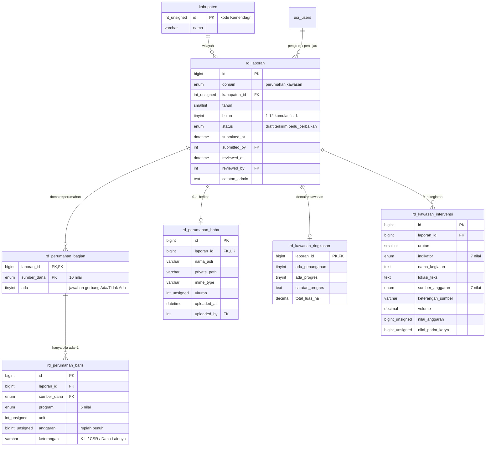

# Skema Data - Rekam Data

> Terpasang & diverifikasi **29 Juli 2026**, migrasi
> [`20260701000021_add_rekam_data.php`](../../application/migrations/20260701000021_add_rekam_data.php).
> Skema lokal `20260701000021`; **production masih `20260701000020`**.
>
> Bukti struktur form sumber: [`STRUKTUR_FORM_SUMBER_REKAM_DATA.md`](../engineering/STRUKTUR_FORM_SUMBER_REKAM_DATA.md).
> Keputusan produk & alasannya: [`PRD_REKAM_DATA.md`](../product/PRD_REKAM_DATA.md).

## 1. Diagram relasi



## 2. Analisis normalisasi

### 2a. Keadaan awal - sumbernya tidak ternormalisasi

Spreadsheet dinas dan kedua Google Form sama-sama **melanggar 1NF** dengan cara berbeda:

| Sumber | Pelanggaran | Wujudnya |
|---|---|---|
| Spreadsheet `tabel_design.png` | grup berulang jadi kolom | 12 kolom `PK RTLH · Anggaran · PB RTLH · Anggaran · …` - nama program tersimpan **di nama kolom**, bukan sebagai nilai |
| Form Perumahan | grup berulang jadi 150 pertanyaan | `APBD KABUPATEN KOTA PK RTLH (unit)` - sumber dana DAN program keduanya di nama field |
| Form Kawasan | grup berulang jadi 20 halaman | blok intervensi 1…20 identik, dibatasi jumlahnya karena Google Forms tidak bisa mengulang baris |

Ketiganya juga menyimpan **nilai turunan** berdampingan dengan sumbernya:
`Total Anggaran` Kawasan = Σ `Nilai Anggaran` intervensi, dan satuan (`Ha`, `m'`, `KK`, `unit`)
menempel di label indikator.

### 2b. 1NF - hilangkan grup berulang

Nama program dan sumber dana dipindah dari *nama kolom* menjadi *nilai baris*:

```
SEBELUM  (1 baris, 12 kolom)
  sumber_dana='APBD Kab Kota', pk_rtlh_unit=120, pk_rtlh_angg=3e9, pb_rtlh_unit=0, …

SESUDAH  (6 baris, 5 kolom)
  (laporan, apbd_kabkota, pk_rtlh,    120, 3000000000)
  (laporan, apbd_kabkota, pb_rtlh,      0,          0)
  …
```

Batas 20 intervensi Kawasan ikut hilang: baris tidak punya kuota.

Satu kolom `SET` sempat dipakai untuk jawaban gerbang (`sumber_ada`) dan **dibatalkan** -
`SET` adalah atribut multi-nilai, tetap pelanggaran 1NF walau MySQL mendukungnya.
Penggantinya tabel `rd_perumahan_bagian`.

### 2c. 2NF - tiap atribut bergantung pada SELURUH kunci

`rd_perumahan_baris`, kunci `(laporan_id, sumber_dana, program)`:

| Atribut | Bergantung pada | 2NF |
|---|---|---|
| `unit`, `anggaran` | seluruh kunci | ✔ |
| `keterangan` | seluruh kunci - form memang menaruh nama penyumbang **per program**, bukan per sumber dana | ✔ |

> Kalau `keterangan` ternyata hanya bergantung pada `(laporan_id, sumber_dana)` - mis. bila
> dinas memutuskan satu perusahaan CSR berlaku untuk semua program - dia harus pindah ke
> `rd_perumahan_bagian`. Struktur form aktual menunjukkan **tidak**, jadi biarkan di sini.

`rd_kawasan_intervensi` berkunci surrogate `id` dengan kunci kandidat `(laporan_id, urutan)`;
seluruh atribut bergantung pada barisnya sendiri. ✔

### 2d. 3NF - tidak ada ketergantungan transitif

Tiga ketergantungan transitif **sengaja tidak disimpan**, karena menyimpannya berarti
mengundang dua angka yang bisa saling bertentangan:

| Nilai | Bergantung pada | Cara memperolehnya |
|---|---|---|
| `satuan` (Ha, m', KK, unit) | `indikator`, **bukan** pada kunci baris | peta konstanta di kode |
| `total_anggaran` Kawasan | himpunan intervensi | `SUM(nilai_anggaran)` |
| angka kumulatif antar bulan | himpunan laporan | agregasi saat rekap |
| `kabupaten.nama` | `kabupaten_id` | tabel `kabupaten` yang sudah ada |

Yang **tetap** disimpan walau kelihatan turunan: `total_luas_ha`. Dia **tidak** bisa
diturunkan dari `volume` intervensi, karena satuan tiap indikator berbeda - menjumlahkan
`m'` dengan `KK` tidak bermakna. Ini fakta tingkat laporan, bukan turunan.

### 2e. BCNF

Tiap tabel: satu-satunya determinan adalah kunci kandidatnya. Tidak ada atribut non-kunci
yang menentukan bagian kunci. **Semua tabel BCNF.** Tidak ada dependensi multinilai
tersisa, jadi 4NF juga terpenuhi.

### 2f. Denormalisasi yang disengaja - nihil

Tidak ada. Tidak ada kolom cache, tidak ada total tersimpan, tidak ada nama tersalin.

## 3. Definisi tabel

Enam tabel. Siklus draft/kirim/perbaikan ditulis **sekali** di amplop bersama, dipakai
kedua domain.

### 3a. `rd_laporan` - amplop bersama

| Kolom | Tipe | Ket |
|---|---|---|
| `id` | BIGINT UNSIGNED AI | PK |
| `domain` | ENUM('perumahan','kawasan') | |
| `kabupaten_id` | INT UNSIGNED | FK `kabupaten(id)` |
| `tahun` | SMALLINT UNSIGNED | |
| `bulan` | TINYINT UNSIGNED | 1-12, kumulatif **sampai dengan** bulan ini |
| `status` | ENUM('draft','terkirim','perlu_perbaikan') | default `draft` |
| `submitted_at` / `submitted_by` | DATETIME / **INT** NULL | FK `usr_users(id)` ON DELETE SET NULL |
| `reviewed_at` / `reviewed_by` | DATETIME / **INT** NULL | FK `usr_users(id)` ON DELETE SET NULL |
| `catatan_admin` | TEXT NULL | alasan "perlu perbaikan" |
| `created_at` / `updated_at` | DATETIME | otomatis |

`UNIQUE (domain, kabupaten_id, tahun, bulan)` · `KEY (domain, status)`

### 3b. `rd_perumahan_bagian` - jawaban gerbang

| Kolom | Tipe |
|---|---|
| `laporan_id` + `sumber_dana` | **PK gabungan** |
| `ada` | TINYINT(1) |

Membedakan **"sumber ini nihil"** dari **"belum diisi"**. Tanpa tabel ini, nol dan kosong
tidak terbedakan di rekap.

### 3c. `rd_perumahan_baris` - angka

`UNIQUE (laporan_id, sumber_dana, program)`

FK-nya menunjuk `rd_perumahan_bagian(laporan_id, sumber_dana)`, **bukan** langsung ke
`rd_laporan`. Dua manfaat: angka mustahil ada tanpa sumber dananya dinyatakan, dan
membatalkan centang sumber dana otomatis menyapu angkanya.

### 3d. `rd_perumahan_bnba` - unggahan

`UNIQUE (laporan_id)` - satu berkas per laporan, sesuai form. Unggah ulang **mengganti**;
berkas lama wajib di-`unlink()` (pola T3, AGENTS.md §0b). Berkas masuk `private_uploads`,
bukan webroot.

### 3e. `rd_kawasan_ringkasan` - 1:1 dengan laporan

`laporan_id` sekaligus PK dan FK. Kolom: `ada_penanganan`, `ada_progres`,
`catatan_progres`, `total_luas_ha DECIMAL(12,2)`.

### 3f. `rd_kawasan_intervensi` - daftar kegiatan

`UNIQUE (laporan_id, urutan)`. Tanpa batas jumlah.
`volume DECIMAL(14,2)` karena `m'` dan `Ha` bisa pecahan.

### 3g. Domain nilai (ENUM)

```
program (6)            pk_rtlh · pb_rtlh · pb_backlog · pk_bencana · pb_bencana · pb_relokasi

sumber_dana (10)       apbd_kabkota · apbn_bsps · apbn_dak · apbn_kemensos · apbn_dana_desa
  - perumahan          apbn_kl_lain · baznas_ri · baznas_kabkota · csr · dana_lainnya

sumber_anggaran (7)    apbn · apbd_provinsi · apbd_kabkota · dana_desa · csr · baznas · dana_lainnya
  - kawasan

indikator (7)          bangunan_gedung · jalan_lingkungan · air_minum · drainase
  - kawasan            air_limbah · persampahan · proteksi_kebakaran
```

> ⚠️ **Dua daftar sumber dana sengaja berbeda** karena form sumbernya memang berbeda.
> Belum ada pemetaan resmi antar keduanya → **angka dua domain tidak boleh dijumlahkan**
> di rekap provinsi sampai dinas menetapkannya.

### 3h. Aturan tipe yang tidak boleh diubah

| Aturan | Alasan |
|---|---|
| FK ke `usr_users(id)` **INT signed** | kolomnya `int(11)` signed; `UNSIGNED` → errno 150 (AGENTS.md §0e) |
| FK ke `kabupaten(id)` **INT UNSIGNED** | kolomnya `int(10) unsigned` |
| Uang `BIGINT UNSIGNED`, rupiah penuh | bukan DECIMAL, bukan float, bukan ribuan. Contoh dinas `Rp3.000.000.000` sudah rupiah penuh |
| Luas `DECIMAL(12,2)`, volume `DECIMAL(14,2)` | pecahan nyata pada Ha dan m' |

## 4. Pemetaan field form → kolom

### 4a. Perumahan

| Field form | Kolom |
|---|---|
| Data Kumulatif Sampai Dengan Bulan | `rd_laporan.bulan` |
| Kabupaten/Kota | `rd_laporan.kabupaten_id` ← **dari sesi**, bukan dropdown |
| *(tahun, tersirat dari judul form)* | `rd_laporan.tahun` |
| `<SUMBER>` gerbang Ada/Tidak Ada | `rd_perumahan_bagian.ada` |
| `<SUMBER> <PROGRAM> (unit)` | `rd_perumahan_baris.unit` |
| `<SUMBER> <PROGRAM> Anggaran (Rp.)` | `rd_perumahan_baris.anggaran` |
| `Kementerian Sumber <PROGRAM>` | `rd_perumahan_baris.keterangan` |
| `Perusahaan CSR <PROGRAM>` | `rd_perumahan_baris.keterangan` |
| `Sumber Anggaran Dana Lainnya <PROGRAM>` | `rd_perumahan_baris.keterangan` |
| UPLOAD BNBA | `rd_perumahan_bnba.*` |

### 4b. Kawasan

| Field form | Kolom |
|---|---|
| Kabupaten/Kota | `rd_laporan.kabupaten_id` ← **dari sesi** |
| Data Kumulatif Sampai Dengan Bulan | `rd_laporan.bulan` |
| Penanganan Kawasan Permukiman Kumuh | `rd_kawasan_ringkasan.ada_penanganan` |
| Apakah terdapat progres realisasi? | `rd_kawasan_ringkasan.ada_progres` |
| Bila "Tidak", jelaskan progres… | `rd_kawasan_ringkasan.catatan_progres` |
| Total Luas Penanganan (Ha) | `rd_kawasan_ringkasan.total_luas_ha` |
| Total Anggaran (Rp.) | ❌ **tidak dipindah** - `SUM(nilai_anggaran)` |
| Sumber Anggaran (paragraf) | ❌ **tidak dipindah** - duplikat dropdown per intervensi |
| Indikator Penanganan | `rd_kawasan_intervensi.indikator` |
| Nama Kegiatan/Program | `.nama_kegiatan` |
| Lokasi Kegiatan/Program | `.lokasi_teks` |
| Sumber Anggaran (dropdown) | `.sumber_anggaran` |
| Volume Penanganan | `.volume` |
| Nilai Anggaran (Rp.) | `.nilai_anggaran` |
| Nilai Padat Karya (Rp.) | `.nilai_padat_karya` |
| *(tidak ada di form)* | `.keterangan_sumber` - **tambahan kita**, supaya CSR Kawasan tidak anonim |
| Apakah ada penanganan lainnya? | ❌ tidak dipindah - jadi tombol "+ Tambah Intervensi" |

### 4c. Cacat form yang diperbaiki di skema

| Cacat form | Di skema |
|---|---|
| `BAZNAS Kab/Kota` kehilangan PB BENCANA | ENUM `program` berlaku seragam - mustahil satu sumber kehilangan program |
| `Kementerian Sumber PB BACKLOG` dobel | `UNIQUE (laporan_id, sumber_dana, program)` menolak |
| Kawasan dibatasi 20 intervensi | tanpa batas |
| Total Luas & Total Anggaran teks bebas | `DECIMAL` dan `BIGINT UNSIGNED` |
| Total Anggaran diketik tangan | tidak disimpan, dihitung |

## 5. Pola query rekap

**Kumulatif s.d. bulan N** - ambil laporan terakhir yang terkirim, jangan dijumlahkan
antar bulan (angkanya sudah kumulatif):

```sql
SELECT b.sumber_dana, b.program, b.unit, b.anggaran
FROM rd_perumahan_baris b
JOIN rd_laporan l ON l.id = b.laporan_id
WHERE l.domain='perumahan' AND l.kabupaten_id=? AND l.tahun=?
  AND l.status='terkirim'
  AND l.bulan = (SELECT MAX(bulan) FROM rd_laporan
                 WHERE domain='perumahan' AND kabupaten_id=l.kabupaten_id
                   AND tahun=l.tahun AND status='terkirim');
```

> ⚠️ **Jebakan terbesar modul ini.** Angka bersifat kumulatif, jadi `SUM()` antar bulan
> akan melipatgandakan capaian. Satu-satunya penjumlahan yang sah adalah **antar kabupaten
> pada bulan yang sama**.

**Total anggaran Kawasan** (nilai turunan, jangan disimpan):

```sql
SELECT l.kabupaten_id, r.total_luas_ha, SUM(i.nilai_anggaran) AS total_anggaran,
       SUM(i.nilai_padat_karya) AS total_padat_karya, COUNT(i.id) AS jml_intervensi
FROM rd_laporan l
JOIN rd_kawasan_ringkasan r ON r.laporan_id = l.id
LEFT JOIN rd_kawasan_intervensi i ON i.laporan_id = l.id
WHERE l.domain='kawasan' AND l.tahun=? AND l.bulan=? AND l.status='terkirim'
GROUP BY l.id;
```

## 6. Bukti verifikasi - 29 Juli 2026

Dijalankan sungguhan di DB lokal `klinikpkp`, bukan dibaca dari kode:

| # | Uji | Hasil |
|---|---|---|
| 1 | 6 tabel + FK terbentuk | ✔ |
| 2 | Periode dobel `(domain,kabupaten,tahun,bulan)` | ✘ ditolak `uq_rd_laporan_periode` (1062) |
| 3 | Baris dobel `(laporan,sumber_dana,program)` | ✘ ditolak `uq_rd_perumahan_baris` (1062) |
| 4 | `kabupaten_id` tidak ada (9999) | ✘ ditolak `fk_rd_laporan_kabupaten` (1452) |
| 5 | **Angka tanpa bagian dinyatakan** | ✘ ditolak `fk_rd_perumahan_baris_bagian` (1452) |
| 6 | Alur benar: bagian → baris | ✔ tersimpan |
| 7 | **Batal centang sumber dana → angkanya tersapu** | ✔ CASCADE, 1 → 0 |
| 8 | `urutan` intervensi dobel | ✘ ditolak `uq_rd_kawasan_intervensi_urutan` (1062) |
| 9 | Hapus laporan → seluruh anak hilang | ✔ semua tabel 0 |
| 10 | `down()` → `up()` | ✔ 6 → 0 → 6, versi kembali `…21` |

## 7. Yang belum ada di skema ini

| Butir | Kenapa ditunda |
|---|---|
| Tabel `rencana`/target | `TABEL UNIT RENCANA` tidak dikumpulkan form mana pun (PRD §7.2) |
| Pemetaan sumber dana antar domain | menunggu ketetapan dinas (§3g) |
| Pemetaan nama kabupaten form → `kabupaten.id` | dibutuhkan hanya saat impor data historis |
| BPHTB & PBG | di luar ruang lingkup, keputusan user (PRD §7.6) |
