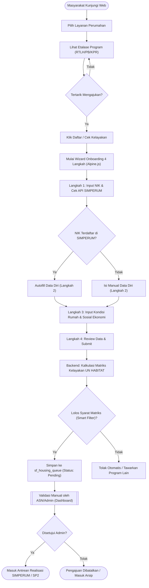
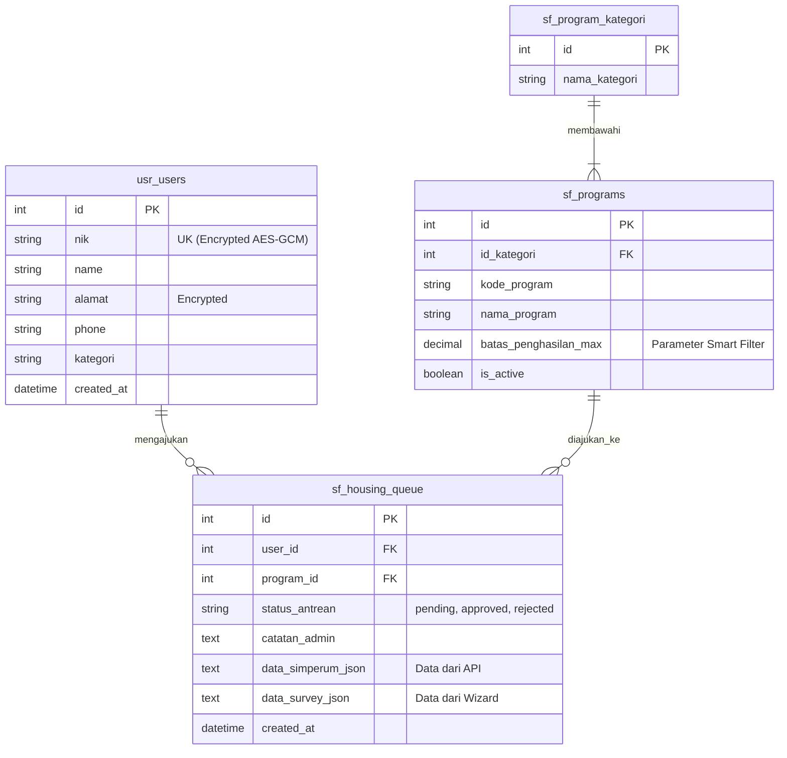

# Desain Sistem: Flowchart & ERD Klinik PKP v3.0

Dokumen ini merumuskan secara visual bagaimana sistem baru (Smart Filter & Housing Queue) bekerja secara integratif dengan antarmuka Wizard 4 Langkah (Alpine.js) dan arsitektur database modular.

## 1. Flowchart: Alur Pengguna (Onboarding Journey)

Berikut adalah _flowchart_ perjalanan masyarakat dari mendaftar hingga dievaluasi menggunakan matriks kelayakan (UN HABITAT) dan masuk ke dalam antrean (Housing Queue).

---

## 2. ERD (Entity Relationship Diagram) Database Modular (v3.0)

Karena adanya pergeseran fokus dari "Forum" menjadi "Layanan Smart Filter", database telah direstrukturisasi menggunakan *prefix* (`usr_`, `sf_`, `forum_`, `sys_`). Berikut adalah relasi terbarunya:

### Penjelasan Tabel Utama:

1. **`usr_users`**: Menggunakan enkripsi `AES-256-GCM` untuk melindungi privasi NIK dan Alamat (Kepatuhan UU PDP).
2. **`sf_program_kategori` & `sf_programs`**: Memisahkan antara kategori (Pembangunan Baru) dengan program spesifik. Nilai kolom `batas_penghasilan_max` pada `sf_programs` digunakan secara dinamis oleh backend saat memproses matriks kelayakan pelamar.
3. **`sf_housing_queue`**: Menampung hasil pendaftaran yang lolos seleksi mesin. Kolom `data_survey_json` menyimpan input riil matriks kelayakan dari *Wizard*, dan `status_antrean` mengakomodasi kebutuhan Validasi Manual ASN (Fase 10).
