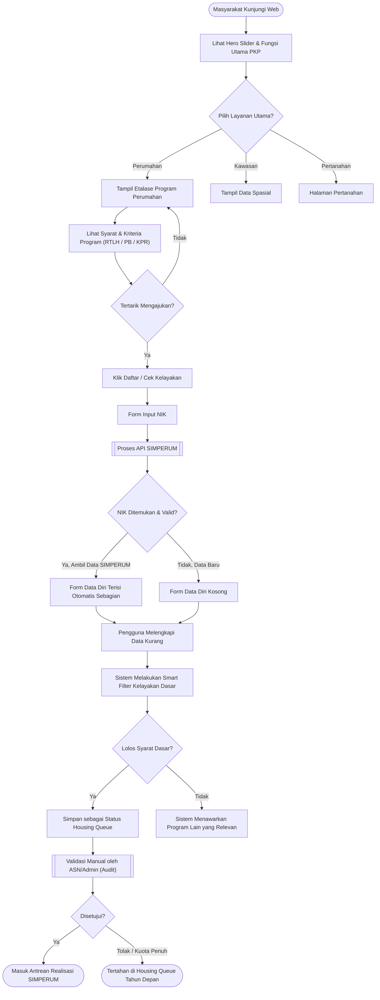
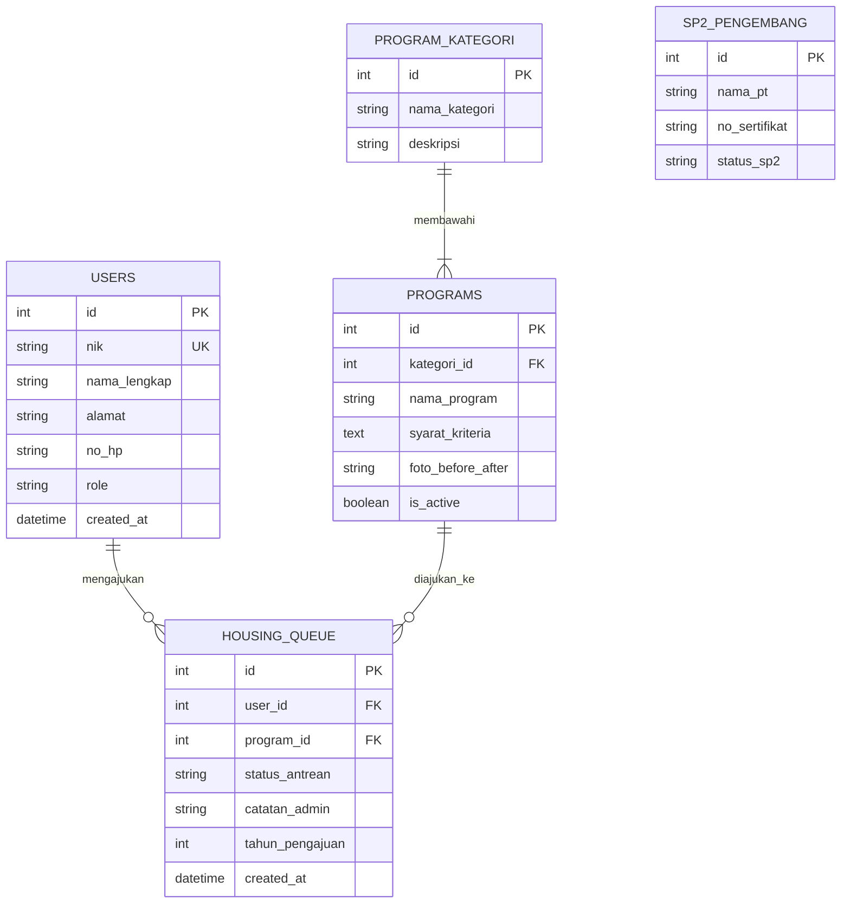

# Desain Sistem: Flowchart & ERD Klinik PKP v2

Dokumen ini merumuskan secara visual bagaimana sistem baru (Onboarding & Housing Queue) akan bekerja dan bagaimana struktur databasenya akan saling terhubung.

## 1. Flowchart: Alur Pengguna (Onboarding Journey)

Berikut adalah _flowchart_ yang menggambarkan perjalanan masyarakat dari melihat "iklan" di beranda hingga data mereka masuk ke dalam antrean (Housing Queue).

---

## 2. ERD (Entity Relationship Diagram) Database Baru

Karena ada konsep _Housing Queue_ dan _Smart Filter_, kita perlu memperbarui desain database. Berikut adalah relasi antar tabel (ERD) utamanya:

### Penjelasan Tabel Utama:

1. **`USERS`**: Menggunakan `nik` (Unique Key / UK) sebagai entitas paling krusial untuk sinkronisasi dengan API SIMPERUM.
2. **`PROGRAM_KATEGORI` & `PROGRAMS`**: Memisahkan antara "Kategori" (Pembangunan Baru) dengan "Program Spesifik" (Rumah Relokasi, RTLH). Hal ini membuat _dashboard/etalase iklan_ menjadi sangat dinamis. Admin bisa menambah program baru tanpa perlu _hard-code_.
3. **`HOUSING_QUEUE`**: Ini adalah "keranjang" antrean. Berisi riwayat pengajuan masyarakat. Kolom `status_antrean` mengakomodasi kebutuhan **Validasi Manual ASN** (bisa _pending_, _disetujui_, atau _ditolak_).
