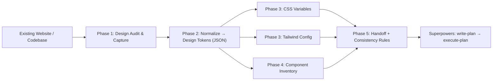

# Web Design Research Skill

## Overview

This plan creates a single Notion page that holds a **Superpowers-style `SKILL.md`** for AI coding agents. The skill teaches any agent to systematically *research an existing website's visual design*, extract every styling detail, and emit a **portable design-system artifact set** (design tokens + CSS variables + Tailwind config + a component inventory). The goal: any developer working with AI on the codebase opens this one document, follows the same procedure, and produces a **consistent, modular redesign** instead of ad-hoc styling.

The document is written in **English** (the standard for AI skill files) and structured exactly like a Superpowers skill: **YAML frontmatter** (`name`, `description`, `when_to_use`, `version`) followed by a body of phased instructions. It deliberately plugs into the Superpowers development path - **brainstorm → write-plan → execute-plan** - so the skill is invoked at the *research/brainstorm* stage and hands a clean spec to the planning stage.

<aside>
🎯

Key outcome: a repeatable workflow where the AI audits a site, captures **colors, typography, spacing, radii, shadows, breakpoints, and component patterns**, normalizes them into tokens, and outputs Tailwind + CSS-variable files plus a component inventory - all formatted so the next agent can rebuild the UI modularly.

</aside>

The page will be rendered as a Notion doc but its core content is the raw `SKILL.md` (shown in a code block so it can be copied straight into the `skills/` folder of the Superpowers plugin repo), with surrounding context callouts explaining usage and the integration point.

## Your Preferences

**Confirmed by the user:**

- **Language:** English (standard for AI skill files)
- **Format:** Superpowers `SKILL.md` style - YAML frontmatter + structured body
- **Required outputs from the skill:** *all* of the following
    - Design tokens (colors, typography, spacing, etc.)
    - Tailwind config / CSS variables
    - Component inventory + tokens

**Inferred conventions:**

- Must fit the Superpowers workflow (`brainstorm → write-plan → execute-plan`); this skill runs at the research stage
- Goal is **consistency + modularity** so any AI editor follows the same path
- Raw `SKILL.md` provided in a copyable code block for dropping into the plugin repo's `skills/` directory

## Implementation Plan

### Step 1: Create the Notion page & frame the purpose

Create a new page titled **"Skill: Web Design Research → Modular Redesign"** in the workspace.

Top of page includes a short orientation block:

<aside>
🧭

**What this is:** A Superpowers skill that makes any AI agent research a website's design and output a consistent, modular design-system artifact set before redesigning.

</aside>

- One-paragraph purpose statement
- A note on **where it lives** in the repo: `skills/web-design-research/SKILL.md`
- A note that it runs during the **brainstorm/research** phase of the Superpowers path

### Step 2: Write the YAML frontmatter

Define the skill metadata block at the top of the `SKILL.md`:

```yaml
---
name: web-design-research
description: Research an existing website's visual design and extract a complete, portable design system (tokens, CSS variables, Tailwind config, component inventory) to drive a consistent, modular redesign.
when_to_use: Use before redesigning or refactoring any web UI, when onboarding to an unfamiliar frontend, or whenever styling decisions must stay consistent across multiple AI editors.
version: 1.0.0
---
```

Naming follows Superpowers conventions (lowercase, hyphenated). `when_to_use` is written so the skill **auto-activates** on relevant tasks.

### Step 3: Phase 1 - Design Audit & Capture

Body section instructing the agent to systematically inventory the existing site before touching code:

- [ ]  Identify all **stylesheets, theme files, and inline styles** in the codebase
- [ ]  Capture the **rendered** values (computed styles), not just source values
- [ ]  Record every recurring visual primitive:

| Category | What to extract |
| --- | --- |
| Color | brand, neutrals, semantic (success/warn/error), states |
| Typography | font families, sizes, weights, line-heights, letter-spacing |
| Spacing | scale, paddings, margins, gaps |
| Layout | grid, container widths, breakpoints |
| Effects | radii, shadows, borders, opacity, transitions |
| Assets | icons, logos, image treatments |

<aside>
📸

Capture **raw observed values first** - normalization happens in Phase 2. Do not invent values that don't exist on the site.

</aside>

### Step 4: Phase 2 - Normalize into Design Tokens

Instructions to deduplicate and structure the raw values into a canonical token set:

- Collapse near-duplicate values into a single token (e.g. `#fafafa`/`#f9f9f9` → `--color-bg-subtle`)
- Use a **tiered naming scheme**: primitive tokens → semantic tokens → component tokens
- Output tokens as platform-neutral JSON:

```json
{
  "color": { "brand": { "500": "#2563eb" }, "bg": { "subtle": "#fafafa" } },
  "font": { "family": { "sans": "Inter, system-ui, sans-serif" } },
  "space": { "1": "4px", "2": "8px", "3": "12px" },
  "radius": { "md": "8px" }
}
```

<aside>
🧱

Tokens are the single source of truth. Everything downstream (CSS vars, Tailwind) is **generated from** these.

</aside>

### Step 5: Phase 3 - Emit CSS Variables & Tailwind Config

Instructions to generate both consumable artifacts from the token set:

**CSS custom properties** (`:root` block):

```css
:root {
  --color-brand-500: #2563eb;
  --space-2: 8px;
  --radius-md: 8px;
}
```

**Tailwind config** (`tailwind.config.js` `theme.extend`):

```jsx
module.exports = {
  theme: { extend: {
    colors: { brand: { 500: 'var(--color-brand-500)' } },
    spacing: { 2: 'var(--space-2)' },
    borderRadius: { md: 'var(--radius-md)' },
  }},
}
```

- Tailwind values **reference the CSS variables** so theming stays in one place
- Include a checklist to verify every token maps to both outputs

### Step 6: Phase 4 - Component Inventory

Instructions to catalog every reusable UI piece and bind it to tokens, enabling modular rebuilds:

- Produce a table of components with their token dependencies and variants:

| Component | Variants | Tokens used | States |
| --- | --- | --- | --- |
| Button | primary, secondary, ghost | brand, radius-md, space-2/3 | hover, focus, disabled |
| Card | default, elevated | bg-subtle, radius-md, shadow-sm | - |
| Input | text, error | border, radius, space | focus, error |
- For each component, note **structure, props/variants, and accessibility** notes
- Flag duplicated/inconsistent components to **consolidate** during redesign

### Step 7: Phase 5 - Handoff & Consistency Rules

Close the skill with the integration + guardrails that keep every AI editor consistent:

**Superpowers handoff:**

```
brainstorm → [THIS SKILL: research + tokens] → write-plan → execute-plan
```

- This skill outputs the artifact set; `write-plan` consumes it to scope the redesign

**Consistency rules (the contract every AI must follow):**

- [ ]  Never hardcode a style value - always reference a token
- [ ]  New values must be added to tokens *first*, then propagated
- [ ]  Keep primitive → semantic → component token tiers intact
- [ ]  Re-run the audit when new pages/components appear

<aside>
🔁

Any agent editing this codebase reads this skill, reuses the token set, and follows the same path - guaranteeing a modular, consistent redesign.

</aside>

### Step 8: Assemble the full copyable [SKILL.md](http://SKILL.md)

Combine frontmatter + all phases into **one continuous fenced code block** at the bottom of the page so it can be copied verbatim into `skills/web-design-research/SKILL.md`.

- The above sections render as readable Notion content for humans
- This final block is the **machine-ready** version for the repo
- Include a one-line install note: drop into the Superpowers plugin's `skills/` directory

## Architecture

