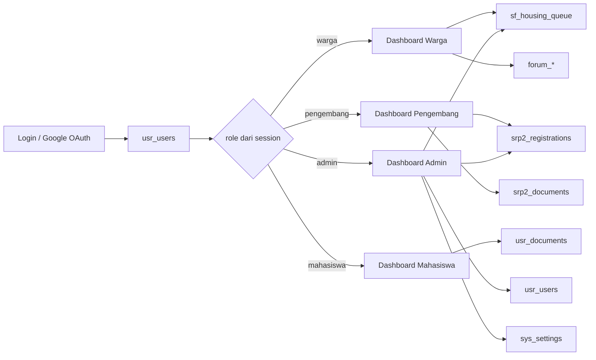

# Peta Relasi Data Dashboard Multi-Role

**Status:** Baseline implementasi 22 Juli 2026
**Pasangan PRD:** [`../product/PRD_DASHBOARD_MULTI_ROLE.md`](../product/PRD_DASHBOARD_MULTI_ROLE.md)

## 1. Peta Aliran Utama



## 2. ERD Operasional

```mermaid
erDiagram
    usr_users ||--o{ usr_documents : owns
    usr_users ||--o{ sf_housing_queue : submits
    sf_program_kategori ||--o{ sf_programs : groups
    sf_programs ||--o{ sf_housing_queue : selected_by
    usr_users ||--o{ forum_diskusi : creates
    usr_users ||--o{ forum_komentar : writes
    forum_diskusi ||--o{ forum_komentar : contains
    forum_komentar ||--o{ forum_komentar : replies_to
    usr_users ||--o{ forum_likes : gives
    usr_users ||--o{ srp2_registrations : submits
    srp2_registrations ||--o{ srp2_documents : contains

    usr_users {
        int id PK
        varchar email UK
        varchar role
        varchar status
        text nik_encrypted
        text alamat_encrypted
    }
    usr_documents {
        int id PK
        int user_id FK
        varchar doc_type
        varchar file_path
    }
    sf_program_kategori {
        int id PK
        varchar nama_kategori
    }
    sf_programs {
        int id PK
        int id_kategori FK
        varchar kode_program UK
        boolean is_active
    }
    sf_housing_queue {
        int id PK
        varchar ticket_code UK
        int user_id FK
        int program_id FK
        enum status_antrean
        text catatan_admin
    }
    forum_diskusi {
        int id_diskusi PK
        int user_id FK
        enum status
        boolean is_deleted
    }
    forum_komentar {
        int id_komentar PK
        int id_diskusi FK
        int user_id FK
        int reply_to FK
        varchar role_snapshot
    }
    forum_likes {
        int id PK
        int user_id FK
        varchar target_type
        int target_id
    }
    srp2_registrations {
        int id PK
        int user_id FK_nullable
        varchar nik_ktp
        varchar nib
        varchar status_verifikasi
        text catatan_admin
    }
    srp2_documents {
        int id PK
        int registration_id FK
        varchar document_key
        varchar stored_name
    }
```

## 3. Relasi Berdasarkan Dashboard

### Warga

```text
usr_users.id
  ├── usr_documents.user_id             → dokumen akun
  ├── sf_housing_queue.user_id         → riwayat pengajuan dan tiket
  ├── forum_diskusi.user_id             → topik milik user
  ├── forum_komentar.user_id            → komentar milik user
  └── forum_likes.user_id               → like user

sf_housing_queue.program_id
  └── sf_programs.id → sf_program_kategori.id
```

Data pengajuan guest memakai `user_id = NULL`; dashboard warga tidak boleh mengklaimnya otomatis hanya berdasarkan NIK atau input bebas.

### Pengembang

```text
usr_users.id
  └── srp2_registrations.user_id
          └── srp2_documents.registration_id

srp2_registrations.status_verifikasi = Diterima
  ├── profil publik pengembang
  └── daftar pengembang tersertifikasi / publikasi
```

`srp2_certified_developers` adalah katalog tersertifikasi yang dikelola admin. Saat ini hubungan ke `srp2_registrations` belum memakai FK; sebagian kode mencocokkan `nama_perusahaan`.

### Mahasiswa

```text
usr_users.id
  └── usr_documents.user_id
          ├── doc_type = ktm
          └── doc_type = surat_magang
```

⚠️ **Dikoreksi 26 Jul 2026:** tabel `kkn_magang_pendaftaran` **sudah ada** (migrasi `20260701000010`) berisi jenis, instansi asal, divisi/tema, periode, surat pengantar, status (`Diajukan`/`Diterima`/`Ditolak`), `catatan_admin`, plus `reviewed_by`/`reviewed_at`. Dashboard mahasiswa di `/akun` membaca tabel ini per `user_id` sesi, dan sisi admin ada di `Admin_Kemitraan` - jadi statusnya nyata, bukan dikarang.

Yang memang **masih belum ada**: jadwal dan pembimbing. Prinsip aslinya tetap berlaku - jangan mengarang status dari `usr_documents` saja.

### Admin

```text
admin session role = admin
  ├── sf_housing_queue → validasi status dan catatan
  ├── srp2_registrations → sumber pengajuan SRP2
  ├── srp2_certified_developers → katalog publik tersertifikasi
  ├── usr_users → statistik dan calon manajemen user
  └── sys_settings → konfigurasi konten website
```

## 4. Tabel Pendukung dan Batas Relasi

| Tabel | Dipakai oleh | Relasi saat ini | Catatan |
|---|---|---|---|
| `usr_users` | Semua akun | Root identitas | `role` masih varchar bebas, bukan FK/enum |
| `usr_documents` | Onboarding warga/pengembang/mahasiswa | FK ke `usr_users` | Cocok untuk KTM dan surat magang |
| `sf_program_kategori` | Smart Filter/admin | FK dari `sf_programs` | Master kategori program |
| `sf_programs` | Warga/admin | FK dari antrean | Program aktif dipilih dari kode hasil diagnosa |
| `sf_housing_queue` | Warga/admin | FK user nullable, FK program | `ticket_code` adalah identitas publik status |
| `forum_*` | Semua user login/admin | Kolom user_id, sebagian tanpa FK database | Identitas tampilan disalin ke kolom nama/role |
| `srp2_registrations` | Pengembang/admin | `user_id` indexed, belum FK | Migrasi terpisah; perlu tersedia di environment |
| `srp2_documents` | Pengembang/admin | `registration_id` | File disimpan private oleh controller baru |
| `srp2_certified_developers` | Pengembang publik/admin | Belum FK ke registration | Katalog admin, pencocokan legacy memakai nama perusahaan |
| `data_sosmed_perumahan` | Publikasi pengembang | Tidak ada user_id | Belum dapat membuktikan ownership pengembang |
| `chat_rooms`/`chat_messages` | Chat publik | Room berdasarkan session token browser | Belum terhubung ke `usr_users`; bukan dashboard personal |
| `sys_menu`/`sys_multi` | Legacy navigasi | Belum menjadi sumber guard utama | Jangan menganggapnya sebagai permission engine aktif |
| `sys_settings` | Admin konten | Key-value | Dipakai `Setting_model` untuk konten website |

## 5. PII dan Batas Tampilan

```text
NIK input
  ├── SHA-256 + pepper → usr_users.nik_lookup_hash
  └── AES-256-GCM     → usr_users.nik

Alamat domisili
  └── AES-256-GCM     → usr_users.alamat
```

- Dashboard tidak menampilkan NIK penuh atau alamat terenkripsi.
- `sf_housing_queue.nik_pengaju` harus diperlakukan sebagai PII dan tidak dikirim ke endpoint cek tiket.
- Dokumen akun dan SRP2 harus dilayani melalui endpoint yang memeriksa owner/admin, bukan URL file publik.
- Catatan admin SRP2 dan antrean bersifat privat kecuali aturan produk menyatakan sebaliknya.

## 6. Gap Data yang Menghambat Dashboard

1. **Role belum kanonis:** onboarding menerima `vendor`, sementara target produk yang dibahas adalah empat role.
2. **Tidak ada tabel permission aktif:** `sys_menu`/`sys_multi` ada, tetapi `Admin_Controller` memakai pengecekan hardcoded.
3. **Mahasiswa belum punya entitas workflow:** baru ada dokumen onboarding.
4. **Publikasi tidak punya ownership:** `data_sosmed_perumahan` menyimpan nama pengembang sebagai teks, bukan `user_id`.
5. **SRP2 belum sepenuhnya terhubung:** registration, dokumen, dan katalog certified developer memakai relasi aplikasi/nama, bukan FK konsisten.
6. **Chat tidak punya user_id:** histori chat belum dapat menjadi data personal dashboard.
7. **Audit belum eksplisit:** perubahan status antrean/SRP2 belum memiliki `updated_by` atau tabel audit.
8. **Schema dan runtime berbeda:** `srp2_registrations` dan tabel SRP2 terkait berasal dari migration terpisah, bukan schema fresh utama.

## 7. Urutan Perubahan Data yang Disarankan

1. Tetapkan daftar role dan migrasikan nilai legacy tanpa menghapus data.
2. Tambahkan guard role di endpoint, tanpa mengubah struktur data dulu.
3. Hubungkan dashboard warga ke `sf_housing_queue` dan dokumen ke `usr_documents`.
4. Pastikan migration SRP2 tersedia sebelum dashboard pengembang dinyatakan live.
5. Tambahkan `owner_user_id` pada data publikasi hanya bila fitur publikasi benar-benar dipakai sebagai data milik pengembang.
6. Tambahkan entitas workflow mahasiswa setelah proses bisnis disepakati.
7. Tambahkan audit status setelah alur validasi admin stabil.

## 8. Sumber Kode dan Schema

- `docs/engineering/schema_klinikpkp.sql`
- `docs/engineering/migration_srp2_registrations.sql`
- `docs/engineering/migration_srp2_certified_developers_and_documents.sql`
- `application/controllers/Auth.php`
- `application/controllers/Pengaturan.php`
- `application/controllers/Pengembang.php`
- `application/controllers/Program.php`
- `application/controllers/Admin.php`
- `application/controllers/Admin_Dashboard.php`
- `application/core/MY_Controller.php`
