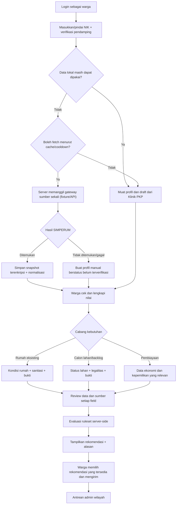

# PRD Form Pendataan Warga dan Integrasi SIMPERUM

**Produk:** Klinik PKP — Pendataan dan Rekomendasi Program Perumahan  
**Versi:** 1.0-draft  
**Tanggal analisis:** 27 Juli 2026  
**Status:** R0–R2 selesai lokal; R3 wizard sedang dikerjakan  
**Menggantikan:** Seluruh langkah diagnosa lama setelah input NIK + tanggal
lahir. Dua input awal tersebut dipertahankan sebagai gerbang langkah pertama
wizard baru.  
**Dokumen pasangan:** [`SKEMA_DATA_FORM_WARGA_SIMPERUM.md`](../architecture/SKEMA_DATA_FORM_WARGA_SIMPERUM.md)
dan [`ROADMAP_FORM_WARGA_SIMULASI_SIMPERUM.md`](./ROADMAP_FORM_WARGA_SIMULASI_SIMPERUM.md)

---

## 1. Otoritas Dokumen

Dokumen ini adalah sumber kebutuhan untuk form warga baru. Implementasi tidak
boleh menyimpulkan aturan bisnis hanya dari tampilan gambar atau dari
`Smart_filter.php` yang sekarang. Urutan otoritas:

1. keputusan tertulis user/Dinas setelah 27 Juli 2026;
2. PRD ini dan keputusan yang sudah berstatus **Diputuskan**;
3. kamus data pendamping;
4. artefak gambar di `C:\Users\ASUS\Downloads\formwarga`;
5. form diagnosa lama hanya menjadi acuan gerbang NIK + tanggal lahir; langkah
   survei, kalkulasi, hasil, dan mesin Smart Filter setelahnya adalah alur usang.

Jika ada pertentangan, catat di Log Keputusan (§17); jangan diam-diam memilih
versi yang paling mudah dikodekan.

## 2. Latar Belakang

Form diagnosa sekarang tetap dipakai sebagai asal pola input NIK + tanggal
lahir. Setelah lookup berhasil/gagal, alur tidak boleh kembali ke survei dan
kalkulasi lama. Artefak baru menunjukkan kebutuhan yang jauh lebih besar:

- identitas dan kondisi sosial-ekonomi rumah tangga;
- status rumah, lahan, anggota keluarga, dan riwayat bantuan;
- kondisi struktur bangunan;
- sanitasi dan utilitas;
- lokasi spasial;
- foto rumah/lahan dan dokumen bukti;
- jalur berbeda untuk rumah eksisting dan calon lahan/backlog.

SIMPERUM menjadi sumber awal, tetapi tidak boleh dipanggil pada setiap halaman
atau setiap kunjungan. Klinik PKP harus menjadi penyimpan lokal yang sah untuk
data yang sudah ditarik dan data pelengkap/hasil koreksi warga.

## 3. Bukti yang Dianalisis

Analisis mencakup seluruh **50 gambar**:

- 5 gambar `FORM_DESAIN`: lima kelompok layar utama;
- 45 gambar `FORM_DETAIL`: daftar dropdown, cabang Backlog, dan bukti.

Terlihat dua route aplikasi sumber:

- `/Main/RTLH/PBDT_edit/` — rumah eksisting/RTLH;
- `/Main/Backlog/ValidasiData` — warga belum memiliki rumah atau calon lahan.

Nilai contoh NIK, KK, nama, dan alamat pada gambar sengaja tidak disalin ke
repo karena merupakan PII. Semua field dan opsi yang terbaca ditranskripsikan
tanpa data orangnya di dokumen skema.

### 3.1 Gap Prototipe Saat Ini

| Komponen sekarang | Keadaan nyata | Target dokumen ini |
|---|---|---|
| `Program::api_cek_simperum()` | Mock dua NIK, delay buatan, cache hanya sesi | Adapter API server-side + cache DB local-first |
| `diagnosa.php` | Satu form sederhana | Wizard adaptif, save/resume per langkah |
| Session identitas/hasil | Kedaluwarsa 30 menit dan hilang saat sesi berakhir | Draft terikat akun, dapat dilanjutkan |
| `Smart_filter.php` | Hardcode desil + status kepemilikan | Decision table per program, versioned + reason codes |
| `sf_housing_queue` | Raw/survey JSON dan NIK plaintext | Assessment terstruktur, snapshot, provenance, PII terenkripsi |
| Admin Kab/Kota | Scope dan transisi dasar sudah benar | Dipertahankan; ditambah layar data/provenance/evidence |

Perbaikan scope admin, transisi status, tiket, dan gerbang server yang sudah
dibangun tidak dibuang. Yang diganti adalah kedalaman intake, persistence,
cache, dan dasar rekomendasinya.

## 4. Sasaran Produk

1. Warga cukup melakukan lookup SIMPERUM saat diperlukan, bukan pada setiap
   langkah, reload, atau login.
2. Data SIMPERUM yang ditemukan disimpan terenkripsi di Klinik PKP.
3. Warga dapat melihat data mana yang sudah tersedia dan melengkapi yang kosong.
4. Koreksi warga tidak menghapus bukti nilai asli dari SIMPERUM.
5. Form panjang dipecah menjadi wizard adaptif dengan simpan draft per langkah.
6. Rekomendasi program dihitung server-side dari snapshot data lengkap dan
   ruleset yang versinya dapat dibuktikan.
7. Admin wilayah dapat menilai data, bukti, sumber nilai, dan alasan rekomendasi.

## 5. Bukan Sasaran Fase Ini

- Menulis balik koreksi/status ke SIMPERUM.
- Menganggap data SIMPERUM selalu benar atau selalu tersedia.
- Membangun pembuat aturan generik/no-code.
- Mengklaim ruleset simulasi sebagai matriks kelayakan resmi Dinas.
- Menghapus antrean atau data diagnosa lama.
- Mengizinkan browser memanggil API SIMPERUM secara langsung.

## 6. Persona dan Kewenangan

| Persona | Kebutuhan | Kewenangan |
|---|---|---|
| Warga | Mengambil data awal, mengecek, melengkapi, menyimpan draft, mengirim | Hanya profil dan assessment miliknya |
| Admin Kab/Kota | Memeriksa pengajuan sesuai wilayah | Hanya `kabupaten_id` pada scope sesi |
| Superadmin | Audit dan koreksi lintas wilayah | Seluruh assessment, dengan jejak audit |
| Sistem Klinik PKP | Cache, normalisasi, validasi, rekomendasi | Tidak boleh mengarang nilai kosong |
| SIMPERUM | Sumber data eksternal awal | Tidak menjadi dependency setiap langkah |

Lookup dan penyimpanan draft PII hanya tersedia untuk akun aktif ber-role
`warga`. Halaman informasi program boleh tetap publik.

## 7. Keputusan Produk yang Mengikat

| ID | Keputusan | Status |
|---|---|---|
| DEC-WRG-001 | Form baru berupa wizard multi-step server-backed, bukan satu form panjang | **Diputuskan** |
| DEC-WRG-002 | Lookup bersifat local-first; reload/Back/Next tidak memanggil SIMPERUM | **Diputuskan** |
| DEC-WRG-003 | Raw response SIMPERUM immutable; koreksi warga disimpan sebagai override lokal | **Diputuskan** |
| DEC-WRG-004 | Data draft disimpan setelah setiap langkah dan dapat dilanjutkan setelah login ulang | **Diputuskan** |
| DEC-WRG-005 | Cabang rumah eksisting dan calon lahan tidak dipaksa mengisi field yang tidak relevan | **Diputuskan** |
| DEC-WRG-006 | Rekomendasi adalah hasil server dan dapat lebih dari satu; warga tidak mengirim `program_id` sewenang-wenang | **Diputuskan** |
| DEC-WRG-007 | Setiap hasil rekomendasi menyimpan versi ruleset dan alasan | **Diputuskan** |
| DEC-WRG-008 | Data yang belum lengkap menghasilkan `needs_data`, bukan nilai default atau penolakan palsu | **Diputuskan** |
| DEC-WRG-009 | PII baru wajib terenkripsi fail-closed; kunci invalid membatalkan write | **Diputuskan** |
| DEC-WRG-010 | Foto/dokumen hidup di private uploads dan hanya disajikan lewat endpoint berizin | **Diputuskan** |
| DEC-WRG-011 | Sistem dibangun lengkap sekarang memakai sumber data SIMPERUM sintetis | **Diputuskan** |
| DEC-WRG-012 | Data simulasi melewati gateway, cache, normalisasi, enkripsi, wizard, scoring, antrean, dan admin yang sama dengan data nyata | **Diputuskan** |
| DEC-WRG-013 | Semua layar/record simulasi diberi label `Mode Simulasi — API SIMPERUM belum terhubung` | **Diputuskan** |
| DEC-WRG-014 | Dummy tidak di-hardcode di controller; penggantian ke API kelak terjadi di batas gateway | **Diputuskan** |
| DEC-WRG-015 | Ruleset demo diberi versi `SIM-*` dan tidak boleh diklaim sebagai keputusan resmi Dinas | **Diputuskan** |
| DEC-WRG-016 | Diagnosa lama hanya menyumbang gerbang NIK + tanggal lahir; seluruh langkah setelahnya digantikan wizard baru, dan hasil diagnosa/program hanya keluar setelah wizard selesai dievaluasi ruleset | **Diputuskan** |
| DEC-WRG-017 | Desil dari SIMPERUM/DTSEN menjadi sumbu utama pengelompokan program seperti matriks yang sudah ada; data wizard menyaring kecocokan di dalam kelompok tersebut dan tidak menghitung ulang desil dari penghasilan | **Diputuskan** |
| DEC-WRG-018 | Wizard tetap satu dan berorientasi data, bukan satu form per program. Desil membentuk kandidat program di server; cabang kondisi warga menentukan modul yang tampil; rekomendasi final baru dihitung setelah kelengkapan kandidat diperiksa | **Diputuskan** |
| DEC-WRG-019 | Fokus tahap sekarang adalah alur dan kontrak data yang matang. Syarat program dipisahkan sebagai ruleset berversi dan dapat diperbarui berkala tanpa membangun ulang wizard atau menimpa hasil historis | **Diputuskan** |
| DEC-WRG-020 | Rate limiting adalah kapabilitas keamanan lintas sistem dengan satu mekanisme bersama dan kebijakan per aksi/domain; fitur warga menjadi konsumen awal, bukan implementasi khusus yang berdiri sendiri | **Diputuskan** |
| DEC-WRG-021 | Integrasi SIMPERUM bersifat GET-only; koreksi warga tetap disimpan di PKP dan tidak ditulis balik lewat `SaveDataRTLH` | **Diputuskan** |
| DEC-WRG-022 | Mode tetap `simulation` sampai smoke test berizin dan sumber desil tersedia | **Diputuskan** |
| DEC-WRG-023 | Review selalu memberi tindakan sesuai hasil: `eligible/potential` dapat dipilih dan diajukan, `needs_data` menjelaskan apakah data bisa diperiksa atau memang belum tersedia, dan `not_eligible` menawarkan pemeriksaan ulang/layanan lain | **Diputuskan** |

## 8. Perjalanan Warga

## 9. Struktur Wizard

Wizard menggunakan langkah bernama, bukan persentase semu. Langkah yang tidak
relevan disembunyikan berdasarkan cabang.

| Langkah | Nama | Isi | Perilaku |
|---|---|---|---|
| 0 | Temukan Data | NIK, verifikasi pendamping, persetujuan pemrosesan | Lookup local-first; satu sumber status yang jujur |
| 1 | Data Warga | Identitas, kontak, demografi, ekonomi | Prefill SIMPERUM; warga mengonfirmasi/melengkapi |
| 2 | Rumah dan Keluarga | Status rumah/lahan, penghuni, keluarga, bantuan, kawasan | Menentukan cabang berikutnya |
| 3A | Kondisi Bangunan | Struktur, bahan, tingkat kerusakan | Hanya jika ada rumah yang dinilai |
| 3B | Calon Lahan | Kepemilikan, legalitas, asal, ukuran, relasi pemilik | Hanya jalur calon lahan/backlog |
| 4 | Sanitasi dan Utilitas | Air, jamban, TPA, septik, listrik, bahan bakar | Hanya jika rumah eksisting dinilai |
| 5 | Lokasi dan Bukti | Pin peta, foto, PDF bukti sesuai cabang | Upload tersimpan satu per satu |
| 6 | Periksa dan Rekomendasi | Ringkasan, sumber nilai, deklarasi, hasil ruleset | Tidak boleh submit bila field cabang belum lengkap |

### 9.1 Aturan UX

- Maksimal kira-kira 5–10 pertanyaan terlihat per layar.
- Tombol utama: **Simpan dan lanjut**; sekunder: **Kembali**.
- Setiap save divalidasi di server dan mengembalikan error per field.
- Reload membuka langkah terakhir yang berhasil disimpan.
- Pindah langkah tidak menghapus nilai cabang lain; saat cabang berubah, nilai
  lama ditandai tidak aktif dan tidak ikut scoring sampai warga mengonfirmasi.
- Field prefill memiliki badge `SIMPERUM`; field lokal memiliki badge
  `Diisi warga`; perubahan warga menjadi `Koreksi warga`.
- Tampilkan waktu snapshot, bukan pesan samar “data terbaru”.
- Dropdown memakai label manusia dan menyimpan kode stabil.
- Error summary dapat difokuskan keyboard; label, hint, dan error terhubung
  secara aksesibel.
- Upload tidak menunggu seluruh form selesai dan tidak hilang saat Back.
- Jangan memuat kelima puluh field ke DOM sekaligus.

## 10. Strategi Local-First SIMPERUM

### 10.1 Urutan Lookup

1. Normalisasi NIK di server, lalu buat HMAC lookup hash.
2. Cari profil warga dan draft lokal yang terikat ke akun.
3. Cari snapshot SIMPERUM terbaru berdasarkan hash NIK.
4. Jika snapshot sukses masih fresh, pakai snapshot; **0 panggilan eksternal**.
5. Jika snapshot `not_found` masih fresh, tawarkan input manual; **0 panggilan eksternal**.
6. Jika cache kedaluwarsa dan cooldown mengizinkan, ambil lock per NIK lalu
   satu proses saja memanggil gateway sumber.
7. Simpan status, waktu, versi API, hash payload, dan payload terenkripsi.
8. Normalisasi hanya field allowlist. Raw payload tidak dikirim ke browser.

### 10.2 Kebijakan Awal

Angka berikut adalah default rancangan dan harus dikonfirmasi dengan pemilik
API sebelum production:

| Kondisi | Default |
|---|---|
| Data ditemukan | Fresh 30 hari |
| NIK tidak ditemukan | Negative cache 24 jam |
| Timeout/5xx | Backoff 15 menit, lalu boleh retry |
| Refresh manual | Maksimal satu kali per NIK per 24 jam |
| Request bersamaan untuk NIK sama | Digabung menjadi satu fetch eksternal |

Kebijakan terpenting bukan angka TTL-nya: **Next, Back, reload, scoring,
halaman admin, dan submit tidak pernah memanggil gateway sumber.**

### 10.3 Merge dan Provenance

Untuk setiap field tersimpan:

- nilai raw SIMPERUM tetap di snapshot immutable;
- nilai normalized SIMPERUM menjadi prefill;
- nilai koreksi warga menjadi override;
- nilai efektif = override yang sudah dikonfirmasi, jika ada; selain itu prefill;
- `source`, `source_snapshot_id`, `confirmed_at`, dan `changed_at` dapat ditelusuri.

Nilai penting seperti NIK, KK, nama, tanggal lahir, alamat, dan status lahan
yang dikoreksi tidak boleh langsung dianggap “terverifikasi”. Admin melihat
nilai sumber dan nilai koreksi berdampingan.

## 11. Persyaratan Fungsional

| ID | Kebutuhan |
|---|---|
| FR-WRG-001 | Sistem mewajibkan akun warga aktif sebelum lookup PII |
| FR-WRG-002 | Lookup menerima NIK dan faktor pendamping; simulasi memakai tanggal lahir, API nyata mengikuti keputusan OPEN-WRG-002 |
| FR-WRG-003 | Sistem memeriksa data lokal sebelum API eksternal |
| FR-WRG-004 | Sistem menyimpan snapshot SIMPERUM terenkripsi dan metadata fetch |
| FR-WRG-005 | API gagal/tidak menemukan data tidak mematikan alur manual |
| FR-WRG-006 | Form memisahkan prefill, nilai efektif, dan koreksi warga |
| FR-WRG-007 | Setiap langkah dapat disimpan dan dilanjutkan lintas sesi |
| FR-WRG-008 | Field wajib dihitung berdasarkan cabang, bukan satu daftar global |
| FR-WRG-009 | Cabang rumah eksisting meminta struktur, sanitasi, lokasi, dan bukti rumah |
| FR-WRG-010 | Cabang calon lahan meminta legalitas, asal tanah, ukuran, lokasi, dan bukti lahan |
| FR-WRG-011 | Sistem menolak kombinasi tidak konsisten, misalnya `tidak_memiliki_tanah` tetapi mengklaim sertifikat sendiri tanpa penjelasan |
| FR-WRG-012 | File divalidasi MIME/ukuran, disimpan privat, dan terikat ke pemilik assessment |
| FR-WRG-013 | Evaluasi program hanya memakai data efektif yang lolos validasi |
| FR-WRG-014 | Hasil menyimpan `ruleset_version`, status, reason codes, dan waktu evaluasi |
| FR-WRG-015 | Warga hanya dapat memilih program dari rekomendasi server yang masih berlaku |
| FR-WRG-016 | Submit membuat snapshot assessment immutable dan antrean `pending` |
| FR-WRG-017 | Admin wilayah melihat seluruh data pembanding, provenance, bukti, dan alasan rekomendasi |
| FR-WRG-018 | Admin dapat meminta perbaikan dengan catatan wajib; warga membuat revisi tanpa mengubah snapshot lama |
| FR-WRG-019 | Riwayat akun warga menampilkan draft, pengajuan, program, status, dan catatan admin |
| FR-WRG-020 | Semua perubahan PII, submit, keputusan, dan refresh SIMPERUM dicatat ke audit log tanpa plaintext NIK |
| FR-WRG-021 | Semua endpoint sensitif memakai kebijakan rate limit bernama dari registry bersama |
| FR-WRG-022 | Lookup NIK dibatasi berdasarkan kombinasi IP, akun, dan hash NIK tanpa menyimpan NIK plaintext |
| FR-WRG-023 | Respons terblokir menggunakan HTTP `429`, header `Retry-After`, dan pesan yang tidak membocorkan keberadaan data |
| FR-WRG-024 | Kebijakan dapat diperluas ke autentikasi, forum, aduan, unggahan, admin, dan integrasi eksternal tanpa membuat tabel/helper baru per fitur |

## 12. Mesin Rekomendasi

`Smart_filter.php` sekarang hanya menilai desil dan status kepemilikan. Itu
tidak cukup untuk data baru dan tidak menjadi sumber aturan final.

Aturan baru:

1. Setiap program memiliki tabel keputusan bisnis tertulis.
2. Implementasi awal boleh berupa kode PHP eksplisit per program; tidak perlu
   rule builder generik.
3. Input yang dipakai harus disebutkan per aturan.
4. Output per program:
   `eligible`, `potential`, `not_eligible`, atau `needs_data`.
5. Output menyertakan reason code yang stabil dan penjelasan manusia.
6. Nilai `needs_data` tidak boleh diam-diam diperlakukan `false`/nol.
7. Desil dari SIMPERUM/DTSEN adalah sumbu utama routing program. Data rumah,
   lahan, sanitasi, ekonomi, lokasi, dan riwayat bantuan menjadi validasi
   lanjutan, pengecualian, atau alasan `needs_data`.
8. Tidak ada rekomendasi yang otomatis menjadi persetujuan bantuan.
9. Perubahan aturan menaikkan `ruleset_version`; hasil lama tidak dihitung
   ulang tanpa tindakan eksplisit.
10. Ruleset mempunyai status `draft`, `active`, atau `retired`, serta waktu
    mulai berlaku. Hanya satu versi aktif dipakai untuk evaluasi baru.
11. Pembaruan syarat yang memakai field tersedia tidak mengubah wizard atau
    skema DB. Kriteria yang membutuhkan data baru wajib melalui perubahan
    skema/form dan migrasi yang terpisah.

### 12.1 Desil sebagai Acuan Wizard Kompleks

1. Setelah lookup, server membaca desil sumber dan membentuk daftar kandidat
   program menurut matriks versi aktif.
2. Kandidat tidak langsung ditampilkan sebagai hasil dan tidak menjadi
   persetujuan.
3. Wizard selalu memuat data inti yang sama: identitas, ekonomi, rumah tangga,
   kepemilikan, dan lokasi.
4. Status rumah/lahan memilih cabang faktual: rumah eksisting, calon lahan,
   atau pembiayaan.
5. Server menambahkan gabungan field validasi yang dibutuhkan seluruh kandidat;
   tidak membuat salinan wizard untuk tiap program.
6. Pada halaman review, setiap kandidat dinilai sendiri. Field kosong
   menghasilkan `needs_data`; syarat gagal menghasilkan `not_eligible`.
7. Hanya rekomendasi final beserta `ruleset_version`, reason code, dan hash input
   yang disimpan ke `sf_rekomendasi_penilaian`.

## 13. Lifecycle

### 13.1 Assessment

`draft → ready_for_scoring → scored → submitted → superseded`

- Hanya draft yang dapat diedit.
- Submit membuat snapshot data dan rekomendasi immutable.
- Perbaikan membuat revisi baru yang menunjuk versi sebelumnya.

### 13.2 Antrean

`pending → needs_revision → pending → approved/rejected`

Transisi status tetap ditegakkan server dan update menyertakan status asal.
Catatan wajib untuk `needs_revision` dan `rejected`.

## 14. Keamanan, Privasi, dan Retensi

- NIK, KK, nama, alamat, telepon, tanggal lahir, NPWP, lokasi presisi, raw
  SIMPERUM, dan snapshot profil dienkripsi AES-256-GCM.
- Lookup memakai HMAC-SHA256 + pepper; jangan hash NIK tanpa pepper.
- Write PII **gagal** bila key/pepper tidak valid. Perilaku fail-open library
  lama tidak boleh dipakai untuk tabel baru.
- NIK plaintext, token API, dan payload raw tidak masuk log, flash, URL, atau analytics.
- Tampilkan NIK/KK termasking kecuali pada layar berizin yang memang memerlukan.
- File privat tidak memiliki URL publik langsung.
- Metadata EXIF foto dibuang saat penyimpanan; lokasi yang diperlukan disimpan
  eksplisit dan terenkripsi, bukan dibiarkan bocor di file.
- Binding NIK ke akun unik; konflik membutuhkan proses admin berjejak audit.
- Semua endpoint POST memakai CSRF, authorization objek, rate limit, dan
  validasi server.
- Scope admin menggunakan kabupaten dari sesi, bukan request.
- Retensi raw SIMPERUM dan berkas menunggu keputusan OPEN-WRG-009; production
  tidak boleh dibuka sebelum jadwal retensi dan penghapusan disetujui.

### 14.1 Rate Limiting Lintas Sistem

1. Gunakan `sys_rate_limits` dan satu layanan/helper bersama. Fitur baru hanya
   menambahkan kebijakan/scope, bukan membuat mekanisme pembatas baru.
2. Setiap kebijakan mendefinisikan aksi, aktor, jendela waktu, batas, dimensi
   kunci, dan apakah percobaan gagal maupun sukses ikut dihitung.
3. Dimensi yang tersedia: hash IP, ID akun, hash NIK ber-pepper, ID objek, serta
   identitas konektor eksternal. Nilai mentah sensitif tidak boleh menjadi key
   atau log.
4. Prioritas penerapan:
   - lookup NIK/tanggal lahir dan cek tiket;
   - login, register, pemulihan akun, dan OAuth;
   - simpan draft, unggah berkas, dan submit final;
   - forum, chat, aduan, dan aksi publik lain;
   - keputusan admin dan ekspor massal;
   - panggilan API eksternal termasuk SIMPERUM.
5. Semua kanal mengembalikan `429` dan `Retry-After`; JSON dan halaman biasa
   menyampaikan waktu tunggu yang konsisten.
6. Pesan gagal lookup tetap sama untuk NIK tidak ada, tanggal lahir salah, dan
   limit aktif sejauh diperlukan untuk mencegah enumerasi.
7. Kebijakan dan angka batas hidup di satu registry konfigurasi, bukan literal
   tersebar di controller atau view.
8. Angka awal ditetapkan konservatif lalu dituning dari metrik penggunaan,
   tingkat false-positive kantor/NAT, dan kuota konektor.
9. Penghitung kedaluwarsa dibersihkan berkala dan tidak menjadi audit log
   permanen. Audit keamanan menyimpan kejadian agregat tanpa PII.

Baseline yang sudah hidup sebelum wizard baru:

| Aksi | Batas sekarang | Catatan |
|---|---:|---|
| Lookup SIMPERUM prototipe | 10/menit per IP | Perlu ditambah dimensi akun + hash NIK |
| Submit antrean warga | 5/jam per IP | Akan dipindah ke kebijakan submit assessment |
| Cek tiket gagal | 5/menit | Sudah memakai respons generik |
| Register akun | 5/10 menit per IP | Kapabilitas lintas fitur yang sudah memakai helper bersama |

## 15. Kriteria Penerimaan End-to-End

1. Lookup pertama yang berhasil menyimpan snapshot dan prefill.
2. Seratus reload/langkah Back/Next setelah itu menghasilkan **nol** fetch tambahan.
3. Dua puluh request paralel untuk NIK sama menghasilkan paling banyak satu fetch eksternal.
4. Snapshot `not_found` mencegah spam fetch dan warga tetap bisa mengisi manual.
5. Timeout SIMPERUM tidak menghapus draft dan tidak memblokir input manual.
6. Koreksi warga tidak mengubah raw snapshot dan provenance dapat dibaca admin.
7. Logout pada langkah mana pun lalu login lagi memulihkan draft terakhir.
8. Jalur rumah eksisting meminta struktur/sanitasi; jalur calon lahan tidak.
9. Field cabang tersembunyi tidak ikut scoring.
10. Kombinasi field invalid ditolak server meski request dipalsukan.
11. File tidak bisa diakses tanpa sesi pemilik/admin berwenang.
12. Ruleset yang dibalik sengaja membuat uji rekomendasi merah di alasan yang diprediksi.
13. Submit ganda dengan idempotency key sama membuat satu antrean.
14. Admin kabupaten lain tidak dapat membaca atau memutuskan assessment.
15. Database dan log tidak memuat plaintext PII baru.
16. Pengajuan lama tetap dapat dibaca setelah migrasi.
17. Mode simulasi terlihat jelas pada lookup, hasil rekomendasi, dan admin.
18. Mengganti fixture dummy dengan fake response lain tidak memerlukan perubahan
    controller wizard, scoring, queue, atau view admin.

## 16. Keputusan Terbuka dan Batas Pengaruhnya

Pertanyaan ini **tidak lagi menghentikan pembangunan mode simulasi**. Roadmap
menetapkan nilai demo yang eksplisit. Pertanyaan tetap harus ditutup sebelum
integrasi API/aturan resmi dinyatakan production-ready.

| ID | Pertanyaan | Pemilik | Menghambat |
|---|---|---|---|
| OPEN-WRG-001 | **Sebagian terjawab 28 Jul:** PDF menetapkan GET `GetDataRTLH?NIK`, token MD5, dan field RTLH; quota, bentuk error nyata, serta status kontrak 2020 belum dikonfirmasi | Tim SIMPERUM | Aktivasi driver API nyata |
| OPEN-WRG-002 | **Sebagian terjawab 28 Jul:** API hanya menerima NIK dan hanya memiliki `TahunLahir`; faktor pendamping resmi tetap perlu keputusan Dinas | Dinas + keamanan | Akses data nyata; PKP tetap memakai login + NIK + tanggal lahir |
| OPEN-WRG-003 | Matriks resmi per program dan prioritas | Pemilik program | Ruleset resmi; simulasi memakai `SIM-2026-01` |
| OPEN-WRG-004 | Arti dan opsi final `Usulan Dari` | Pemilik data | Mapping resmi; simulasi menyimpan null |
| OPEN-WRG-005 | Pisahkan Sumber Bantuan dari alasan penutupan | Pemilik data SIMPERUM | Mapping resmi; simulasi memakai `assistance_source` saja |
| OPEN-WRG-006 | **Sebagian terjawab 28 Jul:** PDF memberi katalog Pekerjaan, Atap, dan Penghasilan; kode Kamar Mandi/Jamban tetap tidak tersedia | Pemilik form | Katalog resmi field tersisa |
| OPEN-WRG-007 | Definisi `Kawasan` per cabang | Pemilik program | Aturan resmi; simulasi memakai union berkode |
| OPEN-WRG-008 | Bukti wajib per cabang dan batas ukuran | Verifikator | Kebijakan resmi; simulasi memakai matriks roadmap |
| OPEN-WRG-009 | Retensi raw API, draft, assessment, dan file | Dinas/DPO | Production data nyata |
| OPEN-WRG-010 | Apakah koreksi lokal disinkronkan balik | Dinas + SIMPERUM | Write-back API; di luar simulation-first |
| OPEN-WRG-011 | TTL/cooldown sesuai quota nyata | Tim SIMPERUM | Tuning driver API; simulasi tetap menguji cache default |
| OPEN-WRG-012 | Field tambahan pembiayaan/KPR | Pemilik pembiayaan | Ruleset resmi; skenario demo memakai field yang tersedia |
| OPEN-WRG-013 | Endpoint/field desil kesejahteraan/DTSEN tidak ada pada kontrak `GetDataRTLH` | Tim SIMPERUM + pemilik data | Rekomendasi program pada mode API; desil dilarang dikarang |

## 17. Log Keputusan

| Tanggal | ID | Keputusan | Dasar |
|---|---|---|---|
| 27 Jul 2026 | DEC-WRG-001 | Gunakan wizard adaptif | Arahan user: form panjang membuat frustrasi |
| 27 Jul 2026 | DEC-WRG-002/003 | Local-first dan raw snapshot immutable | Arahan user: hindari fetch SIMPERUM besar-besaran |
| 27 Jul 2026 | DEC-WRG-005 | Pisahkan cabang rumah eksisting/calon lahan | Dua UI berbeda pada 50 artefak |
| 27 Jul 2026 | DEC-WRG-006/007 | Rekomendasi server dengan versi/alasan | Menutup manipulasi input dan aturan yang menguap |
| 27 Jul 2026 | DEC-WRG-011–015 | Bangun alur lengkap dengan sumber sintetis, berlabel simulasi, melalui gateway yang sama | API SIMPERUM belum diberikan sementara kebutuhan paparan mendesak |
| 28 Jul 2026 | DEC-WRG-016 | Pertahankan hanya input NIK + tanggal lahir dari diagnosa lama; wizard baru menghasilkan rekomendasi program di akhir | Klarifikasi langsung user |
| 28 Jul 2026 | DEC-WRG-017 | Gunakan desil yang sudah dimiliki sebagai sumbu utama rekomendasi; jangan turunkan desil baru dari penghasilan | Klarifikasi langsung user |
| 28 Jul 2026 | DEC-WRG-018 | Satu wizard data bersama; desil memilih kandidat, cabang faktual memilih modul, ruleset menilai hasil akhir | Agar kompleksitas form tidak melahirkan form terpisah per program |
| 28 Jul 2026 | DEC-WRG-019 | Matangkan alur sekarang; syarat program diperbarui berkala sebagai ruleset berversi tanpa menimpa hasil lama | Arahan langsung user |
| 28 Jul 2026 | DEC-WRG-020 | Rate limiting menjadi layanan lintas sistem dengan kebijakan per aksi/domain, dimulai dari fitur warga | Arahan langsung user |
| 28 Jul 2026 | DEC-WRG-021 | Integrasi SIMPERUM saat ini GET-only; `SaveDataRTLH` tidak dipakai dan koreksi warga tetap disimpan di PKP | Sesuai tujuan local-first dan menghindari mutasi sistem eksternal tanpa mandat |
| 28 Jul 2026 | DEC-WRG-022 | Adapter API boleh selesai offline, tetapi mode tetap `simulation` sampai smoke test berizin dan sumber desil tersedia | Kontrak API 2020 tidak memuat desil atau tanggal lahir penuh |
| 28 Jul 2026 | DEC-WRG-023 | Review wajib menampilkan CTA atau alasan blokir yang jelas; hanya `eligible/potential` yang dapat dikirim | Klarifikasi user bahwa warga tidak menemukan jalur pengajuan setelah rekomendasi |

Setiap perubahan requirement menambah baris; jangan hanya mengedit paragraf
lama tanpa jejak.

## 18. Rencana Implementasi

Implementasi simulation-first **boleh dimulai tanpa API SIMPERUM** dan wajib
mengikuti tracker fase, dataset, matriks bukti, serta protokol handoff di
[`ROADMAP_FORM_WARGA_SIMULASI_SIMPERUM.md`](./ROADMAP_FORM_WARGA_SIMULASI_SIMPERUM.md).

API nyata kelak menambah driver di gateway; tidak membangun ulang wizard.
Push production dan migrasi production tetap membutuhkan perintah eksplisit user.
