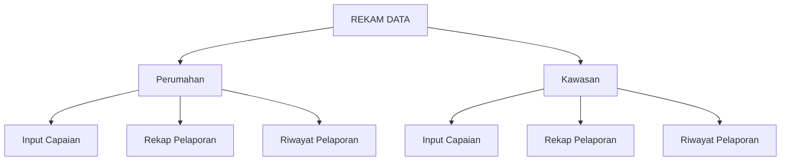
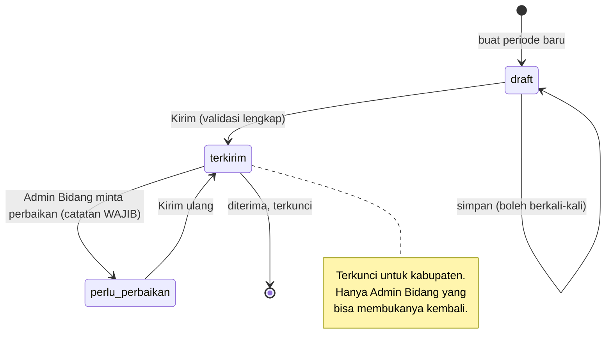
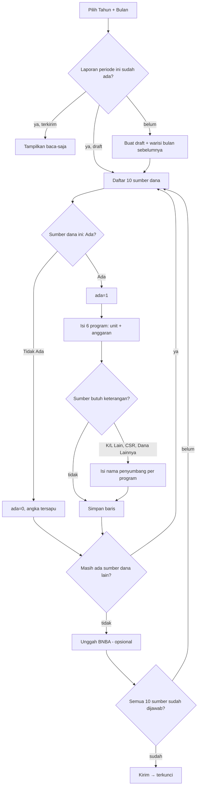
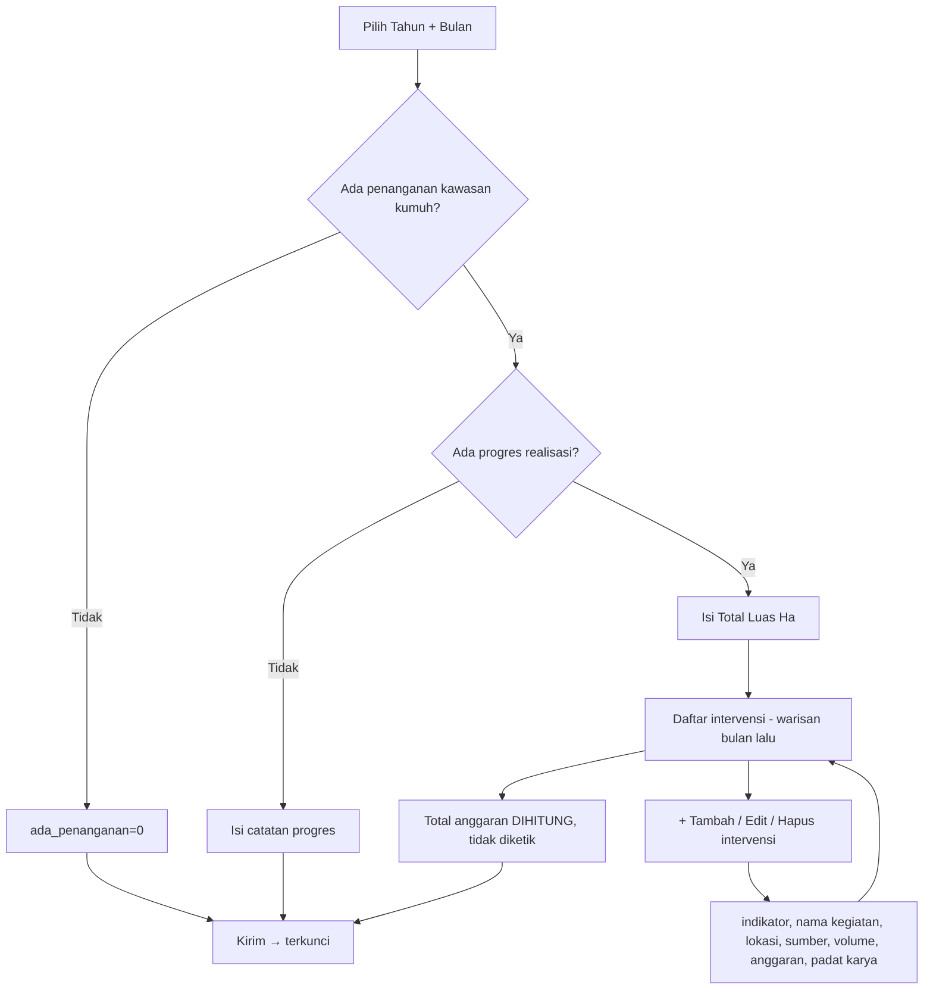
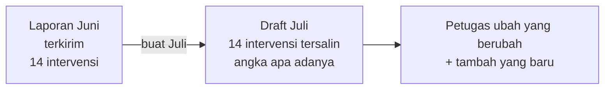

# Roadmap — Rekam Data (D0–D6)

> Ditulis 29 Juli 2026 untuk **dikerjakan agent lain**. Semua klaim di sini berbasis
> pembacaan langsung, bukan ingatan — sumbernya dicantumkan di tiap bagian.
>
> **Baca tiga dokumen ini dulu, berurutan, sebelum menyentuh kode:**
> 1. [`PRD_REKAM_DATA.md`](PRD_REKAM_DATA.md) — ruang lingkup, 7 keputusan user, alasannya
> 2. [`STRUKTUR_FORM_SUMBER_REKAM_DATA.md`](../engineering/STRUKTUR_FORM_SUMBER_REKAM_DATA.md) — struktur kedua form apa adanya + 8 cacatnya
> 3. [`SKEMA_DATA_REKAM_DATA.md`](../architecture/SKEMA_DATA_REKAM_DATA.md) — ERD, normalisasi, DDL terpasang, pemetaan field

## 0. Aturan yang mengikat seluruh tahap

| # | Aturan | Kenapa |
|---|---|---|
| 1 | **Jangan push sebelum migrasi jalan di server.** Branch `feature/homepage-portal-v2` auto-deploy ke PRODUCTION | Lokal skema `…21`, production `…20`. Push duluan = kode baru bertemu tabel yang belum ada. Urutan benar: backup → salin berkas migrasi → `php index.php migrate` → baru `git push` (AGENTS.md §0a) |
| 2 | **Wilayah dari sesi, tidak pernah dari input.** | `Admin_Kabkota_Controller::$my_kabupaten_id` sudah menyediakannya. Dropdown kabupaten di form Google adalah lubang, bukan fitur |
| 3 | **Setiap form wajib token CSRF.** | Jebakan lama: fitur tampak normal, tiap submit 403, audit baca-kode tidak menangkapnya (AGENTS.md §0e) |
| 4 | **Berkas BNBA masuk `private_uploads`**, pakai helper `private_upload`, sajikan lewat `serve_private_file()` | Dokumen berisi nama + alamat penerima bantuan |
| 5 | **Output langsung (`readfile`) wajib `header()` langsung**, bukan `$this->output->set_content_type()` | Antrean header CI baru dikirim saat `_display()`; `nosniff` global membuat berkas tampil sebagai teks acak (AGENTS.md §0e) |
| 6 | **Jangan pernah menampilkan angka/status karangan.** Kalau belum bisa dihitung, hilangkan elemennya | Sudah dua kali terjadi di repo ini (AGENTS.md §0d) |
| 7 | **Angka bersifat KUMULATIF.** `SUM()` antar bulan = capaian berlipat | Jebakan terbesar modul ini. Satu-satunya penjumlahan sah: antar kabupaten pada bulan yang sama |
| 8 | Uji HTTP lintas-request lewat **Apache XAMPP**, bukan `php -S` | Built-in server gagal inisialisasi ulang session CI3 pada request kedua (AGENTS.md §0e) |
| 9 | Harness ber-DB-sementara **wajib** mengalihkan `PRIVATE_UPLOADS_PATH` juga | Pernah memakan 14 berkas dev karena id bertabrakan (AGENTS.md §0e) |
| 10 | `load->model('Nama_model')` lalu panggil `$this->Nama_model` — **persis sama huruf besar-kecilnya** | Beda kapitalisasi = `Undefined property`, halaman 500, `php -l` tidak menangkapnya |

## 1. Peta menu

| Role | Perumahan | Kawasan |
|---|---|---|
| `admin_kabkota` | isi + rekap + riwayat, wilayah sendiri | idem |
| `admin_bidang` `perumahan` | tinjau semua kabupaten | ✘ |
| `admin_bidang` `kawasan` | ✘ | tinjau semua kabupaten |
| `admin` | keduanya | keduanya |

## 2. Siklus status laporan

Transisi ditegakkan **di model**, bukan di view. `WHERE` untuk update wajib menyertakan
status asal — pola yang sudah terbukti di `Admin_Srp2::proses()` dan
`Housing_assessment_model::transition_queue()`.

## 3. Alur pengisian — Perumahan

**Perbedaan dari form Google, disengaja:** tidak ada 21 halaman berurutan. Kesepuluh sumber
dana tampil sebagai satu daftar; pengisi boleh melompat bebas. Gerbang "Ada/Tidak Ada" tetap
ada karena datanya bermakna (§ PRD: membedakan nihil dari belum diisi), tapi tidak lagi
menentukan navigasi.

## 4. Alur pengisian — Kawasan

**Tiga cacat form yang hilang di sini:** tanpa batas 20 intervensi · "Tidak ada progres"
tidak lagi mewajibkan Total Luas & Total Anggaran · Total Anggaran dihitung, bukan diketik.

## 5. Pewarisan antar bulan — WAJIB

Karena angkanya kumulatif, memaksa mengetik ulang akan membuat capaian **menyusut diam-diam**
setiap kali ada petugas yang malas. Ini syarat, bukan kenyamanan. Berlaku untuk keduanya:
Perumahan mewarisi `bagian` + `baris`, Kawasan mewarisi `ringkasan` + `intervensi`.

Sumber warisan = laporan **terakhir yang berstatus `terkirim`** pada tahun yang sama,
bulan terbesar yang lebih kecil dari bulan baru. Kalau tidak ada, mulai kosong.

## 6. Tahapan

### D0 — Fondasi data ✅ SELESAI 29 Jul 2026

Migrasi [`20260701000021`](../../application/migrations/20260701000021_add_rekam_data.php):
6 tabel, ternormalisasi sampai BCNF, 10 uji constraint hijau termasuk round-trip
`down()`→`up()`. Bukti lengkap di `SKEMA_DATA_REKAM_DATA.md` §6.

Ikut selesai: PRD, dokumen bukti struktur form, dokumen skema, roadmap ini.

**Jangan dikerjakan ulang.** Kalau tabelnya terasa kurang, baca §7 dokumen skema dulu —
kemungkinan besar sudah tercatat sebagai ditunda beserta alasannya.

---

### D1 — Model + siklus status + scope

**Kerjakan:** `application/models/Rekam_data_model.php`

| Method | Tugas |
|---|---|
| `ambil_atau_buat_draft($domain,$kab,$tahun,$bulan)` | idempoten; termasuk pewarisan §5 |
| `simpan_bagian()` / `simpan_baris()` | perumahan, transaksional |
| `simpan_ringkasan()` / `simpan_intervensi()` | kawasan |
| `transisi($laporan_id,$dari,$ke,$aktor,$scope,$catatan)` | **satu-satunya** pintu ubah status |
| `rekap($domain,$tahun,$bulan,$kab=NULL)` | pakai pola query di dokumen skema §5 |

**Definisi selesai:**
- Transisi ilegal (mis. `draft` → `perlu_perbaikan`) ditolak model, bukan disembunyikan view
- `UPDATE` status selalu menyertakan status asal di `WHERE`
- Laporan `terkirim` tidak bisa ditulis oleh `admin_kabkota`
- Kabupaten lain tidak terbaca — dibuktikan dengan **melepas guard sementara** dan check jadi merah

**Check:** `php index.php migrate uji_rekam_data_d1`

> Dikoreksi 29 Jul 2026 saat D1 dikerjakan: rencana semula `docs/engineering/uji_rekam_data_d1.php`
> dengan pola `uji_perjalanan_warga.php`. Pola itu HTTP+curl dan butuh controller —
> D1 belum punya satu pun. Pola yang memang sudah ada di repo untuk check
> level-model adalah method CLI di `Migrate.php` (`uji_warga_r1`, `uji_warga_r2`),
> jadi itu yang dipakai. Mulai D2 (sudah ada controller) barulah harness HTTP
> berdiri sendiri sesuai rencana awal.

---

### D2 — Perumahan: input + draft

**Kerjakan:** `controllers/Rekam_Perumahan.php` extends `Admin_Kabkota_Controller`,
view kisi 10 sumber × 6 program.

**Definisi selesai:**
- Kabupaten dari sesi; tidak ada dropdown wilayah di mana pun
- CSRF di semua form
- Angka negatif, bukan-angka, dan anggaran tanpa unit ditolak **server**
- Realisasi tersimpan sebagai rupiah penuh
- Batal centang sumber dana menyapu angkanya (sudah dijamin FK, buktikan lewat UI)
- Simpan berkali-kali tidak menggandakan baris

**Check:** `uji_rekam_data_d2.php` + satu lintasan browser sungguhan

---

### D3 — Perumahan: kirim + BNBA + pewarisan

**Definisi selesai:**
- Kirim ditolak kalau ada sumber dana yang belum dijawab Ada/Tidak Ada
- Kirim mengunci; layar berubah baca-saja
- Unggah BNBA: hanya jenis berkas yang diizinkan, masuk `private_uploads`, unggah ulang
  meng-`unlink()` berkas lama
- **Menekan Unggah tanpa memilih berkas tidak boleh 404** — bug ini pernah terjadi di
  modul Warga (AGENTS.md §0b)
- Buat periode baru mewarisi periode terkirim terakhir (§5)
- Berkas BNBA tidak terbaca tanpa sesi, dan tidak terbaca oleh kabupaten lain

**Check:** `uji_rekam_data_d3.php`, termasuk uji negatif unduh lintas-wilayah

---

### D4 — Kawasan lengkap

**Kerjakan:** `controllers/Rekam_Kawasan.php`, view ringkasan + daftar intervensi berulang.

**Definisi selesai:**
- Tanpa batas jumlah intervensi
- "Tidak ada penanganan" / "tidak ada progres" bisa dikirim **tanpa** memaksa isi Total Luas
- Total anggaran & total padat karya **dihitung**, tidak pernah diketik
- Satuan tampil otomatis mengikuti indikator, tidak disimpan
- Hapus intervensi memperbaiki `urutan` supaya tidak bolong
- Pewarisan bulan sebelumnya jalan

**Check:** `uji_rekam_data_d4.php` + browser

---

### D5 — Rekap & Riwayat

**Definisi selesai:**
- Rekap menampilkan periode terpilih; **tidak ada `SUM()` antar bulan** (aturan §0 no. 7)
- Label eksplisit di layar: "kumulatif s.d. `<bulan>`"
- Dua domain **tidak digabung** — beri catatan kenapa (daftar sumber dana beda)
- Riwayat: daftar periode + status, baca-saja
- Tabel lebar bergulir horizontal di ponsel, `<body>` tidak ikut bergulir
- Belum ada data → keadaan kosong yang jujur, **bukan angka nol karangan**

---

### D6 — Peninjauan provinsi + pembuktian akhir

**Kerjakan:** layar `admin_bidang` — daftar laporan terkirim, detail, terima / minta perbaikan.

**Definisi selesai:**
- `admin_bidang` `perumahan` tidak bisa membuka laporan kawasan, dan sebaliknya
- "Minta perbaikan" wajib catatan; catatan tampil ke kabupaten
- Kirim ulang memakai laporan yang sama, tidak membuat periode baru
- Keputusan kena rate limit (pola `admin_queue_decision`)
- **Uji balik:** balikkan satu guard scope → check harus MERAH di titik yang diramalkan,
  lalu hijau lagi setelah dipulihkan. Skrip yang tidak pernah merah bukan bukti
- Runner DB bersih: baseline → migrasi 1→21 → seluruh check D1–D6 hijau, `.env` pulih
  byte-identik, DB sementara terhapus

## 7. Risiko

| Risiko | Wujudnya | Penangkal |
|---|---|---|
| `SUM()` antar bulan | Capaian provinsi 4–12× lipat, tampak wajar | Aturan §0 no. 7 + tes rekap yang membandingkan dengan angka bulan terakhir |
| Pewarisan tidak dibuat | Capaian menyusut tiap bulan | D3/D4 definisi selesai |
| Dua domain dijumlahkan | Angka salah yang tidak mungkin dilacak | D5 melarang; daftar sumber dana memang beda |
| BNBA bocor | Nama + alamat penerima bantuan terbuka | Aturan §0 no. 4 & 5 |
| Migrasi 21 dihapus dari server setelah dipakai | `migrate` berikutnya menjalankan **DOWN**, tabel terhapus | Berkas migrasi WAJIB tetap ada (AGENTS.md §0e) |
| Push sebelum migrasi | Production 500 | Aturan §0 no. 1 |

## 8. Protokol serah-terima antar agent

1. **Perbarui tracker di bawah setiap tahap selesai** — beserta tanggal dan bukti, bukan centang kosong.
2. **Selesai = terverifikasi.** Laporkan apa adanya; sebutkan bagian yang dilewati.
3. **Verifikasi mengalahkan dokumen ini.** Kalau kode dan dokumen berbeda, kode yang benar — perbaiki dokumennya saat itu juga.
4. **Jebakan baru → satu baris di AGENTS.md §0e.** Tabel itu satu-satunya yang mencegah kesalahan yang sama terulang.
5. **Pekerjaan besar mendarat → perbarui AGENTS.md §0b/§0c.**

## 9. Tracker

| Tahap | Status | Tanggal | Bukti |
|---|---|---|---|
| D0 Fondasi data | ✅ selesai | 29 Jul 2026 | `SKEMA_DATA_REKAM_DATA.md` §6 — 10 uji hijau + round-trip |
| D1 Model & status | ✅ selesai | 29 Jul 2026 | `migrate uji_rekam_data_d1` **48/48** di DB lokal. Uji balik: guard scope `laporan()` dilepas → **2 gagal** tepat di `Laporan kabupaten lain tidak terbaca` + `Isi laporan kabupaten lain tidak terbaca`, lalu 48/48 lagi setelah dipulihkan; nol jejak mutasi tersisa. |
| D2 Perumahan input | ✅ selesai | 29 Jul 2026 | `uji_rekam_data_d2.php` **26/26** lewat HTTP Apache nyata (login → gerbang → angka → batal centang → terkunci); stdout bersih. Uji balik: scope sesi dilepas di kedua jalur tulis controller → **tepat 2 gagal** setelah harness diperbaiki. Percobaan pertama memberi 3 gagal karena uji terkunci berbagi sumber dana `csr` dengan uji scope — kegagalan beruntun, bukan kunci bocor; uji terkunci kini memakai `baznas_ri`. |
| D3 Perumahan kirim | ✅ selesai | 29 Jul 2026 | `uji_rekam_data_d3.php` **43/43** lewat HTTP Apache nyata; bukti dari DB **dan disk**. Uji balik: scope `unduh_bnba` dilepas → **tepat 2 gagal** (`Admin wilayah lain dapat 404`, `Nol byte PDF bocor`), 43/43 lagi setelah dipulihkan. Menemukan 1 bug nyata: `mime_type` dari `$_FILES['type']` (kiriman klien) dipakai sebagai header `Content-Type` — diperbaiki jadi `finfo` atas berkas yang sudah mendarat. |
| D4 Kawasan | ✅ selesai | 29 Jul 2026 | `uji_rekam_data_d4.php` **39/39** lewat HTTP Apache nyata: 25 intervensi (batas 20 form dinas tidak dibawa), urutan rapat setelah hapus di tengah, total dihitung dari `SUM()` dan nol input total di layar, "tidak ada penanganan" bisa dikirim tanpa Total Luas, pewarisan 24 intervensi. Uji balik: scope `hapus_intervensi` dilepas → **tepat 1 gagal**, 39/39 lagi setelah dipulihkan. |
| D5 Rekap & Riwayat | 🟡 hijau, uji balik tertunda | 29 Jul 2026 | `uji_rekam_data_d5.php` **35/35** lewat HTTP Apache nyata. Inti: Juni=25 & Juli=40 dibuktikan **tidak** dijumlahkan jadi 65 (di HTML maupun di DB), label "kumulatif s.d. `<bulan>`" eksplisit, draft tidak masuk rekap, dua domain tidak digabung berikut alasannya, keadaan kosong tidak merender tabel nol. Rekap Perumahan memakai bentuk matriks 10×6 sesuai spreadsheet dinas — bentuk yang tidak dipakai di layar input karena tidak punya tempat untuk gerbang Ada/Tidak Ada. Uji balik: scope wilayah `rekap()` dilepas → **tepat 2 gagal**, 35/35 lagi setelah dipulihkan. |
| D6 Peninjauan & pembuktian | ✅ selesai | 29 Jul 2026 | `uji_rekam_data_d6.php` **35/35**: perjalanan penuh kabupaten↔provinsi (kirim → minta perbaikan → perbaiki → kirim ulang → terima), bidang perumahan & kawasan saling tertutup (404 lintas domain, nol angka bocor), catatan peninjau sampai ke layar input DAN riwayat kabupaten, kirim ulang memakai laporan yang sama, rate limit `admin_queue_decision` terbukti `429`. Menemukan 1 bug nyata: catatan perbaikan hanya tampil di riwayat, tidak di layar tempat perbaikannya dikerjakan — sudah ditambahkan di kedua layar input. Uji balik: gerbang domain `laporan_bidang()` dilepas → **1 gagal tepat di gerbangnya**. Uji "nol angka bocor" ikut lolos karena kecelakaan: view memilih cabang dari bidang peninjau, bukan domain data, sehingga laporan yang lolos dirender dengan cabang salah dan tampil kosong. Diperbaiki: cabang kini ditentukan `$laporan['domain']`. Runner DB bersih [`uji_rekam_data_fresh.php`](../engineering/uji_rekam_data_fresh.php) **HIJAU**: baseline → migrasi 1→21 (versi `…21`, 35 kabupaten) → D1–D6 seluruhnya hijau, `.env` pulih byte-identik (hash sama), DB sementara dan folder unggahan sementara terhapus. Runner mengalihkan `DB_NAME` **dan** `PRIVATE_UPLOADS_PATH`; mengalihkan salah satu saja membuatnya abort. |

## 10. Pertanyaan terbuka untuk dinas

Tidak memblokir D1–D6, tapi jawabannya mengubah D5 dan pekerjaan lanjutan:

1. **`TABEL UNIT RENCANA`** ada di spreadsheet tapi tidak dikumpulkan form mana pun — dipakai, diisi dari sumber lain, atau sisa format lama?
2. **Pemetaan sumber dana** Perumahan ↔ Kawasan. Tanpa ini rekap provinsi tidak bisa digabung.
3. **`APBD Provinsi` & `Baznas Prov`** ada di spreadsheet, hilang dari form. Sengaja?
4. **`Proteksi Kebakaran`** satu-satunya indikator tanpa satuan. Volume-nya menghitung apa?
5. **35 akun `admin_kabkota`** — siapa yang menyediakan dan mendistribusikannya?
